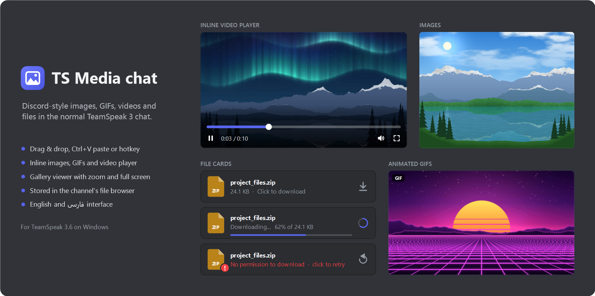
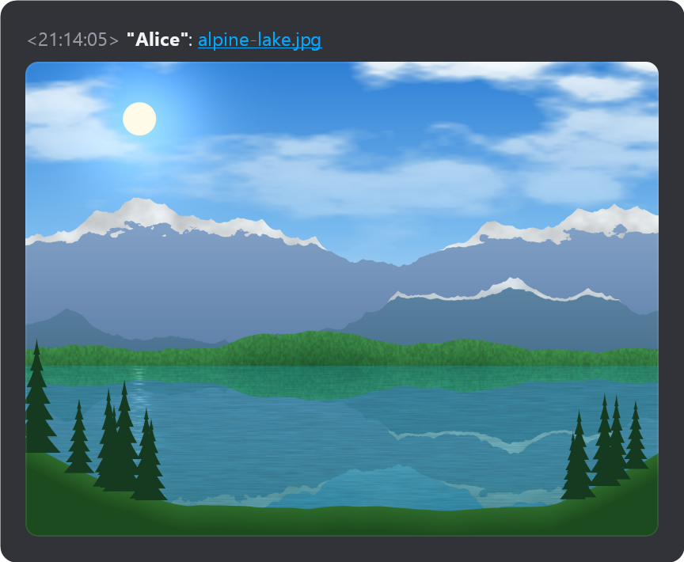
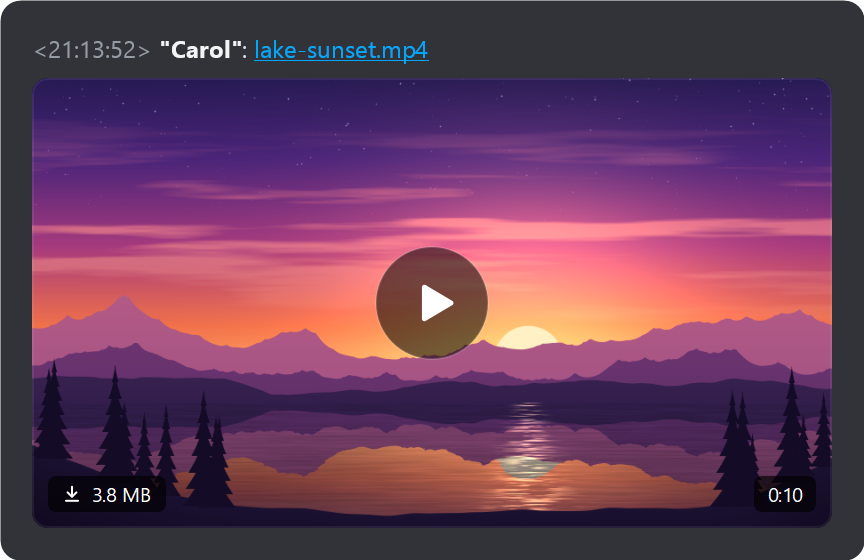
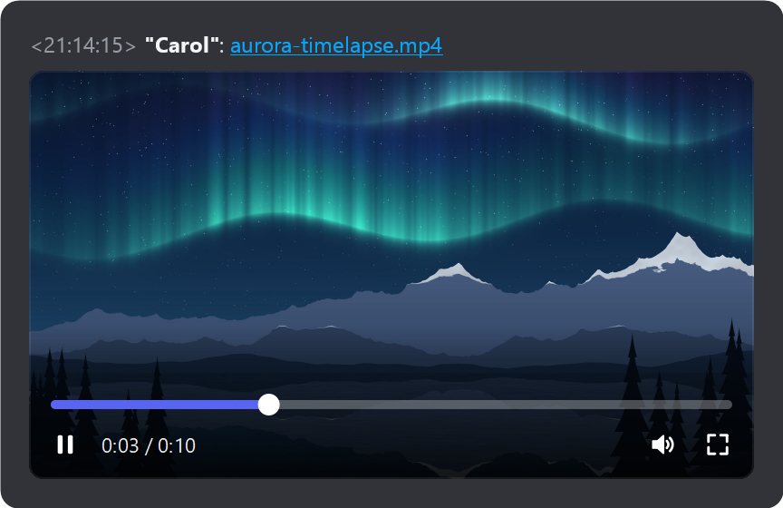
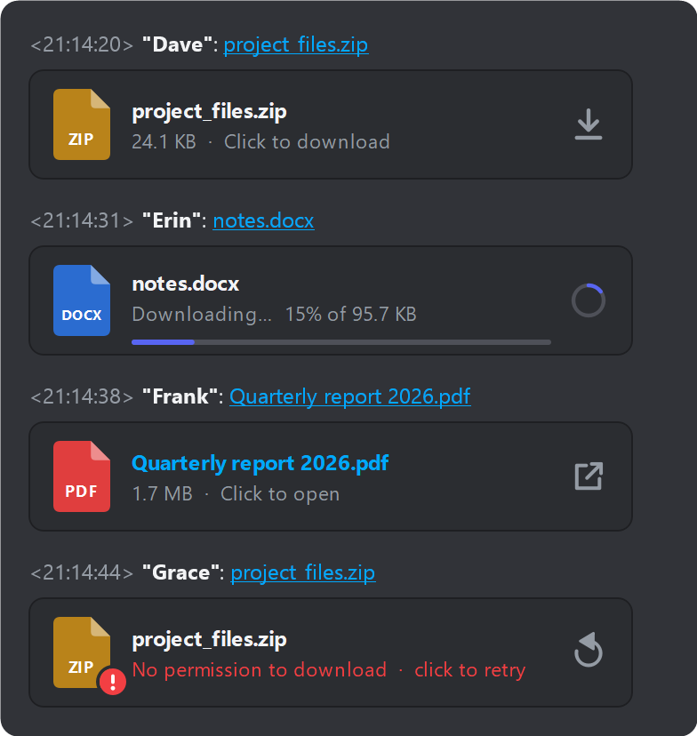
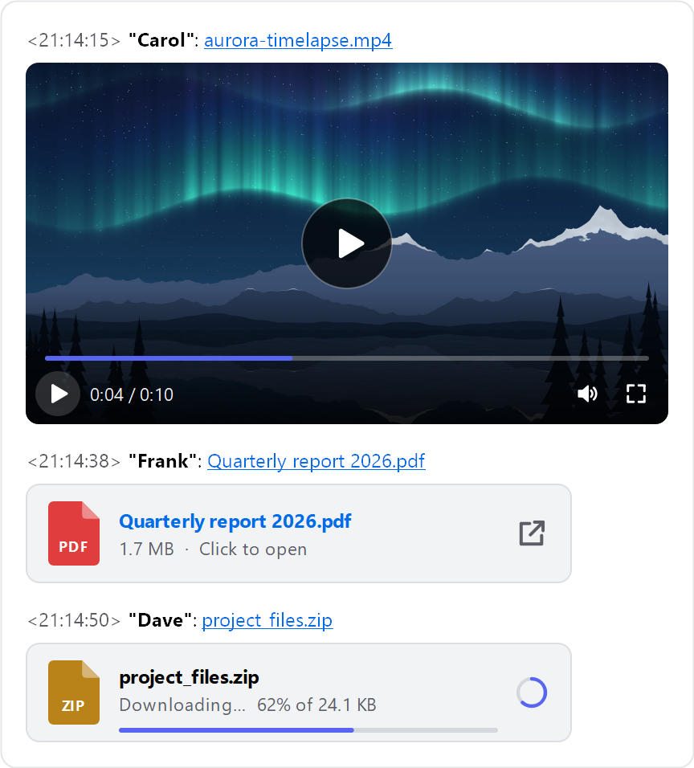

<div align="center">

# TS Media chat

**Discord-style images, GIFs, videos and files in the TeamSpeak 3 chat**

[](https://github.com/Metihttp/Teamspeak_Media_chat/releases/latest)


### [Download the latest version](https://github.com/Metihttp/Teamspeak_Media_chat/releases/latest)


</div>



**TS Media chat** is a plugin for the **TeamSpeak 3 client** on Windows. Drop a file on the chat or paste a screenshot with
**Ctrl+V**: it is uploaded to the channel's own file browser on your TeamSpeak server and posted as a normal TeamSpeak file
link. Everyone with the plugin sees images, animated GIFs and videos right inside the chat, with an inline player and a
gallery viewer. Everyone else still gets a working download link, plus a short note saying the plugin is needed to see it inline.

**Quick install:** download `TSMedia-<version>.ts3_plugin` from the
[latest release](https://github.com/Metihttp/Teamspeak_Media_chat/releases/latest), double-click it, confirm TeamSpeak's installer
and restart TeamSpeak. Requires TeamSpeak 3.6.x. TeamSpeak 5 and 6 are not supported.

## Screenshots

<table>
  <tr>
    <td align="center" width="50%">
      <br>
      <sub>Images inline, sized before they load</sub>
    </td>
    <td align="center" width="50%">
      <br>
      <sub>Animated GIFs</sub>
    </td>
  </tr>
  <tr>
    <td align="center">
      <br>
      <sub>Video poster with duration</sub>
    </td>
    <td align="center">
      <br>
      <sub>Inline video player</sub>
    </td>
  </tr>
  <tr>
    <td align="center">
      <br>
      <sub>File cards for everything else</sub>
    </td>
    <td align="center">
      <br>
      <sub>Light TeamSpeak themes work too</sub>
    </td>
  </tr>
</table>

---

**Contents:**
[Features](#features) ·
[Requirements](#requirements) ·
[Installation](#installation) ·
[People without the plugin](#what-people-without-the-plugin-see) ·
[Usage](#usage) ·
[Settings](#settings) ·
[Server admin guide](#server-admin-guide) ·
[Privacy & security](#privacy--security) ·
[FAQ & troubleshooting](#faq--troubleshooting) ·
[Building from source](#building-from-source) ·
[Project structure](#project-structure) ·
[Credits](#credits) ·
[Copyright & license](#copyright--license)

## Features

- **Send anything.** Drag & drop files onto the chat, paste a screenshot or copied files with Ctrl+V (always with a
  confirmation), or use the Plugins menu, a hotkey or `/tsmedia send`. Several files at once; channel, server and private chats.
- **Stored on your own server.** Files go to the channel's file browser (`/tsmedia`), small previews to
  `/tsmedia/previews`. No third-party hosting.
- **Inline images** with correctly sized placeholders (a BlurHash blur), so the chat never jumps while media loads.
- **Animated GIFs** (and animated WebP) play right in the chat.
- **Inline video player** (Windows Media Foundation): poster with duration, play/pause, seek bar, mute and expand. Only one
  video plays at a time.
- **Gallery viewer:** every media item of the chat, zoom & pan, a full video player with volume, loop and full screen, and
  keyboard shortcuts.
- **File cards** for everything else: icon, name and size; click to download and open.
- **Right-click menu:** open, open with default app, save as, copy image, copy link, show in folder, download / retry,
  play / pause, mute.
- **Works for everyone else too:** people without the plugin get a normal TeamSpeak download link and a short grey note that
  links to this page.
- **Clear errors** right in the chat: no permission, file deleted from the server, password-protected channel, not
  connected, transfer quota exhausted, with click-to-retry.
- **English and Persian** user interface (chosen automatically from the Windows regional format, or set by hand),
  right-to-left in Persian.
- **Light and dark** TeamSpeak themes.
- **Cache with a size limit.** The media used least recently is removed first; media that is playing or open in the viewer
  never is.
- **Safe by design.** Received executables are never launched, untrusted link data is validated and huge images are never
  decoded.

## Requirements

- **TeamSpeak 3 Client 3.6.x** on Windows. The package contains a 64-bit and a 32-bit DLL. The 64-bit build is tested; the
  32-bit build is included but has not been tested on a real 32-bit client yet.
- **TeamSpeak 5 and TeamSpeak 6 are not supported** (they don't load TeamSpeak 3 plugins).
- The server must allow file transfers for your group; see the [server admin guide](#server-admin-guide).
- Video playback uses Windows Media Foundation, which is part of Windows. H.264 (most .mp4 files) works out of the box;
  HEVC, VP9 and AV1 need the matching video extension from the Microsoft Store (see the [FAQ](#faq--troubleshooting)),
  and Windows N editions need the Media Feature Pack.
- Everyone who wants to see media inline needs the plugin. Everyone else still gets the download link.

## Installation

**Install**

1. Download `TSMedia-<version>.ts3_plugin` from the [latest release](https://github.com/Metihttp/Teamspeak_Media_chat/releases/latest)
   (currently `TSMedia-2.0.6.ts3_plugin`).
2. Closing TeamSpeak first is recommended.
3. Double-click the file. TeamSpeak's own package installer opens and shows the author (MehdiHttp), the version and the
   platform. Click **Install**, and answer **Yes** when it asks whether to activate the add-on.
4. Start TeamSpeak again. The plugin is enabled; if it isn't, enable it in **Tools → Options → Addons**.
5. To check, type `/tsmedia` in the chat: the plugin prints its name, version and commands.

**Update:** download the new `.ts3_plugin`, **close TeamSpeak completely** (the old DLL is locked while TeamSpeak runs),
double-click the new file and start TeamSpeak again. Settings and the cache are kept.

**Uninstall or disable:** in **Tools → Options → Addons** you can disable or uninstall the plugin. To do it by hand, close
TeamSpeak and delete `tsmedia_win64.dll` and `tsmedia_win32.dll` from `%APPDATA%\TS3Client\plugins`. To remove the settings
and the cache too, delete `%APPDATA%\TS3Client\plugins\tsmedia`. Files you have sent stay on the TeamSpeak servers; delete
them in the channel's file browser if needed.

> Portable TeamSpeak installations use the `config` folder inside the TeamSpeak folder instead of `%APPDATA%\TS3Client`.

## What people without the plugin see

To someone without the plugin, your message is an ordinary TeamSpeak file link followed by a grey, italic note:

> <ins>holiday_3f9a1c2e.jpg</ins> <i>— <a href="https://github.com/Metihttp/Teamspeak_Media_chat">TS Media chat</a> plugin required to view this in chat</i>

- Clicking the file name downloads the file with TeamSpeak's own file transfer (download permission required).
- "TS Media chat" in the note links to this GitHub page.
- The note is written in the **sender's** interface language (English or Persian).
- People with the plugin never see the note: the plugin removes it from their chat view (even with inline previews turned off).
- Senders can turn the note off or change its link (Settings → Sending).

## Usage

### Sending files

| Method | How |
| --- | --- |
| Drag & drop | Drop one or more files on the chat (on the messages or on the input line). They are sent right away. Hold **Shift** while dropping to get TeamSpeak's normal behaviour. Drags from TeamSpeak's own file browser keep working as before. |
| Paste (Ctrl+V) | Take a screenshot (e.g. Win+Shift+S) or copy files in Explorer, click the chat input line and press **Ctrl+V**. A dialog shows what will be sent and where (channel, server or private chat); nothing is sent until you click **Send**. Plain text still pastes as usual. |
| Menu | **Plugins → TS Media chat → Send file / image to chat…** |
| Hotkey | In **Tools → Options → Hotkeys**, click **Add**, then **Show Advanced Actions**, and pick **Plugins → Plugin Hotkey → TS Media chat → Send file / image to the current chat**. |
| Chat command | `/tsmedia send` |

- The message goes to the chat tab you are looking at: channel, server or a private chat. The file itself is always stored in
  the file browser of **the channel you are currently in**.
- If the partner of a private chat can't be identified (for example they left the server), nothing is sent: something meant
  for one person never ends up in the channel instead.
- A small panel in the corner of the chat shows upload progress and speed; its **×** button cancels the upload.

### Where files are stored

- Files are uploaded as `/tsmedia/<name>_<8 random hex digits>.<ext>`, e.g. `/tsmedia/holiday_3f9a1c2e.jpg`. Spaces become
  `_`, unusual characters are replaced, the name (without the extension) is cut to 48 characters and the extension is
  lower-cased. The random part keeps names apart; an existing file is never overwritten.
- A pasted image is sent as `new_photo_<random>.png`, or converted to JPEG (quality 90) if it is larger than 2 MB and has no
  transparency.
- With *Upload a small preview* on (the default), previews are stored as `/tsmedia/previews/<name>.jpg`. They are only made
  for photos larger than 1.5 MB or with a side longer than 2560 px (preview up to 1280 px), animated GIFs / WebPs larger than
  4 MB (first frame, up to 640 px) and every video (poster up to 960 px).
- If the folder can't be created (no `i_ft_directory_create_power`), the file goes to the root of the channel's file browser
  and its preview to `/previews`, or next to the file as `<name>.preview.jpg`.
- The folder and the maximum upload size (default 100 MB) can be changed in the settings.

### Viewing media

- **Images and GIFs** up to 15 MB load automatically. Larger ones show their preview (or blur) with a download button and
  the file size, and load when clicked. Clicking an image or GIF opens the gallery viewer.
- **Videos** show their poster, a play button and the duration. Clicking play downloads the video first (a progress ring
  with percentage) and then plays it right in the chat. Hover to show the controls: play/pause, time, seek bar, mute and
  expand (opens the gallery). The controls hide 2.5 s after the mouse stops. Starting a video pauses any other.
- **Other files** (audio files included) appear as cards. Click to download and open them with the default Windows app.
  Executables and scripts are never run; they are only shown in Explorer.
- Ordinary TeamSpeak file links (for example a file dragged from the file browser into the chat) get the same treatment,
  just without the dimensions, duration, blur placeholder and preview that TS Media chat adds to its own links.
- You have to be connected to the server the file is on. Up to 3 downloads run at once, previews first.
- When something goes wrong, the reason is written on the preview or card. Click it to retry (not offered for deleted
  files or password-protected channels).

### Right-click menu

Right-click any preview or card:

| Item | Shown for |
| --- | --- |
| Play / Pause | videos |
| Mute / Unmute | videos that have been started |
| Open | always (media opens in the viewer, other files in their default app) |
| Open with default app | downloaded images and videos |
| Save as… | downloaded files |
| Copy image | downloaded images |
| Copy link | always (the `ts3file://` link) |
| Show in folder | downloaded files |
| Download / Retry download | files not downloaded yet, or whose download failed |

### Viewer and keyboard shortcuts

In the viewer, the mouse wheel zooms around the pointer, dragging pans, and double-clicking an image switches between *fit
to window* and *actual size*. Clicking a GIF pauses or resumes it, clicking a video plays or pauses it, and double-clicking
a video toggles full screen. The bottom bar has Fit, 100%, Copy image (Copy frame for videos), Save as…, Show in folder and
Open with default app. Volume changes made in the viewer are remembered.

| Key | Action |
| --- | --- |
| <kbd>←</kbd> / <kbd>→</kbd> | previous / next item of the gallery |
| <kbd>Shift</kbd>+<kbd>←</kbd> / <kbd>Shift</kbd>+<kbd>→</kbd> | seek 5 s back / forward (video) |
| <kbd>Space</kbd> or <kbd>K</kbd> | play / pause a video; pause / resume a GIF |
| <kbd>Home</kbd> | back to the start of the video |
| <kbd>M</kbd> | mute / unmute |
| <kbd>↑</kbd> / <kbd>↓</kbd> | volume up / down by 5% |
| <kbd>F</kbd> | full screen |
| <kbd>Esc</kbd> | leave full screen, otherwise close the viewer |
| <kbd>0</kbd> | fit the image to the window |
| <kbd>1</kbd> | actual size (100%) |
| <kbd>Ctrl</kbd>+<kbd>C</kbd> | copy the image, or the current video frame |
| <kbd>Ctrl</kbd>+<kbd>S</kbd> | save as… |

Letter keys also work with a Persian (or any other non-Latin) keyboard layout.

### Chat commands

| Command | What it does |
| --- | --- |
| `/tsmedia send` | pick files and send them to the current chat |
| `/tsmedia settings` | open the settings |
| `/tsmedia cache` | open the media cache folder |
| `/tsmedia debug` | write a list of TeamSpeak's chat widgets to `widget_dump.txt` in the plugin's data folder (for bug reports) |
| `/tsmedia` | print the name, version and command help |

## Settings

Open the settings with **Plugins → TS Media chat → Settings…**, `/tsmedia settings`, or the plugin's Settings button in
**Tools → Options → Addons**. **Restore defaults** fills in the default of every option (click **OK** to keep them).
Settings are stored in `%APPDATA%\TS3Client\plugins\tsmedia\settings.ini`.

**Receiving**

| Setting | Default | Notes |
| --- | --- | --- |
| Show images, videos and file cards inside the chat | on | When off, only the links are shown (the "plugin required" note stays hidden). |
| Load images and GIFs automatically | on | |
| Load images automatically up to | 15 MB | 1–500 MB. Larger images and GIFs load when clicked. |
| Play GIFs automatically | on | When off, GIFs play while the mouse is over them. |
| Download videos automatically up to | Never (when I press play) | 0–4096 MB; 0 means a video is only downloaded when you press play. |
| Preview max width | 400 px | 120–1200 px. |
| Preview max height | 300 px | 80–1200 px. |

**Playback**

| Setting | Default | Notes |
| --- | --- | --- |
| Volume | 80% | For inline videos and the viewer. |
| Start videos muted | off | |
| Loop videos | off | |

**Sending**

| Setting | Default | Notes |
| --- | --- | --- |
| Drop files on the chat to send them | on | Holding Shift while dropping skips it. |
| Ctrl+V a screenshot or copied files in the chat line to send them | on | Always asks before sending. |
| Convert large pasted screenshots to JPEG | on | Pasted images larger than 2 MB without transparency. |
| Upload a small preview with large images and videos | on | Others see a sharp preview right away while the full file loads. |
| Tell people without the plugin that it is needed | on | The grey note after the link. |
| Download link | this GitHub page | The page "TS Media chat" in the note links to. Must be an `http://` or `https://` address (`https://` is added when missing); empty means `https://github.com/Metihttp/Teamspeak_Media_chat`. Only editable while the note is on. |
| Max upload size | 100 MB | 1–4096 MB. |
| Folder in channel files | `/tsmedia` | Empty means the root of the channel's file browser. |

**General**

| Setting | Default | Notes |
| --- | --- | --- |
| Language | Automatic (Windows language) | Automatic, English or Persian. Automatic picks Persian when the Windows *regional format* (Windows Settings → Time & language) is Persian, English otherwise. Some texts (menus, hotkeys) change after restarting TeamSpeak. |
| Cache size limit | 1024 MB | 100 MB to 1 TB. Beyond it the oldest downloaded media is deleted. The space in use is shown next to it, with **Open folder** and **Clear** buttons. |

## Server admin guide

The plugin uses TeamSpeak's own file transfer. **If a user can upload and download files in a channel with the file
browser, the plugin works for them.** Nothing has to be installed or configured on the server, only permissions:

| Permission | Needed for | Rule |
| --- | --- | --- |
| `i_ft_file_upload_power` | sending (uploading) | Must be at least the channel's `i_ft_needed_file_upload_power`. |
| `i_ft_file_download_power` | seeing media inline, downloading | Must be at least the channel's `i_ft_needed_file_download_power`. |
| `i_ft_directory_create_power` | creating `/tsmedia` and `/tsmedia/previews` | Must be at least the channel's `i_ft_needed_directory_create_power`. Without it, files go to the channel root. |

- On a default TeamSpeak server, **the Guest server group cannot upload** (its `i_ft_file_upload_power` is not high enough).
  New users can't send anything until you grant it to Guest or to the group your members are in.
- Transfer volume can be limited per client with `i_ft_quota_mb_upload_per_client` and
  `i_ft_quota_mb_download_per_client`, and for the whole virtual server with its upload and download quotas. When a quota is
  used up, previews and cards show *Server transfer quota reached*.

**Granting permissions in the TeamSpeak client**

1. Connect with an identity that has admin rights.
2. Open **Permissions → Server Groups**.
3. Select the group on the left (for example Guest, or the group your members are in).
4. Find the permissions in the **File Transfer** section (untick *Show granted only* if they aren't listed).
5. Grant the permission with a value at least as high as the channel's matching *needed* value. A channel's needed values
   are shown in **Permissions → Channel Permissions**.

With ServerQuery, the same is done with `servergroupaddperm` (find the group id with `servergrouplist`):

```text
servergroupaddperm sgid=<group id> permsid=i_ft_file_upload_power permvalue=<power> permnegated=0 permskip=0
```

**Folders and housekeeping**

- `/tsmedia` is created automatically in each channel the first time someone sends a file there, and `/tsmedia/previews`
  the first time a preview is uploaded. Each user can change the folder name in their own settings.
- The plugin never deletes sent files (it only removes the preview of an upload that was canceled or failed). Cleaning up
  old files is up to the server admins, in the channel's file browser.
- Uploading to **password-protected channels** is not supported; the plugin refuses with a message. Downloading a file stored
  in a password-protected channel fails with *Channel is password protected*.
- The server's file transfer port (TCP 30033 by default) must be reachable for clients. If TeamSpeak's own file browser
  doesn't work, the plugin can't work either.

## Privacy & security

- **Files only go to your TeamSpeak server.** Uploads and downloads use TeamSpeak's own file transfer into the channel's
  file browser. There is no other server or cloud service; the plugin makes no web requests and collects no telemetry. The
  only web address involved is the GitHub link in the note, which opens only if someone clicks it.
- Anyone on the server with download permission for that channel can get the file. Treat sent files like any other file in
  the file browser: they stay on the server until someone deletes them.
- **Local cache:** downloaded media is kept in `%APPDATA%\TS3Client\plugins\tsmedia\cache`, limited by the cache size you
  choose, and can be cleared at any time. Temporary copies of files being sent live in the `upload` folder next to it and
  are deleted after sending (or at the next start).
- **Pasting always asks first:** the clipboard may hold something old you forgot about.
- **Executables are never launched:** `.exe`, `.bat`, `.cmd`, `.msi`, `.ps1`, `.vbs`, `.js`, `.lnk`, `.jar`, `.dll`, `.reg`,
  `.scr`, `.ts3_plugin` and the other types Windows runs on double-click are only shown in Explorer (trailing-dot and
  trailing-space tricks included).
- **Chat links are untrusted input**, since anyone can type a link with fake metadata. Dimensions are clamped to 16384 px
  and an aspect ratio of at most 8:1; invalid BlurHashes or ones longer than 120 characters are ignored; preview paths must
  be absolute, in the same channel and without `..`; preview downloads above 5 MB are aborted; images above 80 megapixels
  are never decoded (they show *Can't preview this image* and can be opened in your default app); expensive decodes run
  off the GUI thread; file names are sanitised before
  they touch the disk, and control and bidi characters are stripped from displayed names, so a name can't disguise its real
  extension; a download whose size doesn't match the link is discarded.
- **Automatic downloads are limited:** by default only images and GIFs up to 15 MB; videos only when you press play.
- The DLL is not code-signed. If you prefer, [build it yourself](#building-from-source).

## FAQ & troubleshooting

**TeamSpeak shows "Bad Image" with error status `0xc0000020` at start.**
Windows considers the plugin DLL damaged. Usually an antivirus product quarantined or modified it, or the download was
incomplete. Close TeamSpeak, download the package again from the
[releases page](https://github.com/Metihttp/Teamspeak_Media_chat/releases/latest) and reinstall. If it happens again, add an
exclusion for `%APPDATA%\TS3Client\plugins` in your antivirus. The DLL is unsigned, so some antivirus heuristics may flag it.

**TeamSpeak's installer says `Failed to extract: plugins`.**
That was a problem of old packages (up to 2.0.3) and is fixed since 2.0.4. Download the latest release.

**An image received from another server says "This image can't be shown".**
Older versions sometimes cached images and videos received from remote servers incompletely (zeros at the end of the
file). Since version 2.0.5 the plugin waits until TeamSpeak has finished writing a download, and detects and re-downloads damaged copies from
earlier versions automatically. Just update.

**A video doesn't play.**
Inside the chat, a video that Windows can't open is handed to your default video app instead; the gallery viewer names the
missing decoder. H.264 (most .mp4 files) works out of the box. For the others, install the matching Microsoft Store
extension: **HEVC Video Extensions** for HEVC (H.265), **VP9 Video Extensions** for VP9 (many .webm files),
**AV1 Video Extension** for AV1 and **MPEG-2 Video Extension** for MPEG-2. Windows N editions (e.g. Windows 11 Pro N) need
the **Media Feature Pack**. Formats Windows can't decode at all (ProRes, DNxHD, …) can still be opened with right-click →
*Open with default app*.

**Other people don't see my images in the chat.**
They need the plugin too, and download permission in that channel. Without the plugin they see the link and the note, and
can click the link to download the file.

**"No permission to download" or "You don't have permission for this file on this server".**
Your group lacks the file transfer permissions; show the [server admin guide](#server-admin-guide) to your server admin.

**Files end up in the channel root instead of `/tsmedia`.**
Your group doesn't have `i_ft_directory_create_power`.

**"Uploading to password-protected channels is not supported yet."**
The plugin can't send files in a password-protected channel. Use another channel.

**A preview says "Not connected to this server".**
The file is on a server you are not connected to (for example after a disconnect). Reconnect and click the preview.
Downloads interrupted by a lost connection resume by themselves once you are back.

**"File is larger than the 100 MB upload limit (see settings)."**
Raise *Max upload size* in Settings → Sending (up to 4096 MB). Server quotas still apply.

**Does it work with TeamSpeak 5 or TeamSpeak 6?**
No. They don't load TeamSpeak 3 plugins. The plugin is made for TeamSpeak 3.6.x.

**macOS or Linux?**
No, the plugin is Windows only.

**32-bit TeamSpeak?**
The package includes a 32-bit DLL, but it hasn't been tested on a real 32-bit client yet. If you try it, please report the
result in the issues.

**The plugin doesn't show up in TeamSpeak.**
Check that you run TeamSpeak 3.6.x and that the plugin is enabled in **Tools → Options → Addons**. The TeamSpeak log
(`%APPDATA%\TS3Client\logs`) should contain a line like `TS Media chat 2.0.6 loaded`.

**I don't want Ctrl+V or dropping files to send anything.**
Both can be turned off in Settings → Sending. For a single drop, hold Shift.

**The cache takes too much space.**
Lower the cache size limit or click **Clear** in Settings → General. Media still in the chat is downloaded again when needed.

## Building from source

Requirements:

- Windows 10 or 11
- [Visual Studio 2022 Build Tools](https://visualstudio.microsoft.com/downloads/) with the **Desktop development with C++**
  workload (MSVC, the Windows SDK and the bundled CMake)
- Qt 5.15.2 for MSVC 2019, both 64-bit (`msvc2019_64`) and 32-bit (`msvc2019`): the Qt version TeamSpeak 3.6 ships. The
  easiest way to get it is [aqtinstall](https://github.com/miurahr/aqtinstall).
- Git and Python 3

```powershell
git clone --recursive https://github.com/Metihttp/Teamspeak_Media_chat.git
cd Teamspeak_Media_chat

python -m pip install aqtinstall
python -m aqt install-qt windows desktop 5.15.2 win64_msvc2019_64 --archives qtbase -O C:\dev\Qt
python -m aqt install-qt windows desktop 5.15.2 win32_msvc2019 --archives qtbase -O C:\dev\Qt

powershell -ExecutionPolicy Bypass -File scripts\build.ps1
```

- Output: `dist\TSMedia-<version>.ts3_plugin`, containing `tsmedia_win64.dll` and `tsmedia_win32.dll` in the same layout
  as packages from myteamspeak.com. The version comes from `project(... VERSION ...)` in `CMakeLists.txt`.
- Cloned without `--recursive`? Run `git submodule update --init` (the TeamSpeak plugin SDK is a git submodule).
- `build.ps1` options: `-Qt64 <dir>` / `-Qt32 <dir>` for Qt outside `C:\dev\Qt\5.15.2\...`, `-No32` to build the 64-bit
  DLL only, `-Config <Release|Debug>`, and `-Install` to also copy the 64-bit DLL into `%APPDATA%\TS3Client\plugins`
  (close TeamSpeak first).
- Plain CMake works too:

  ```powershell
  cmake -S . -B build -G "Visual Studio 17 2022" -A x64 -DCMAKE_PREFIX_PATH=C:\dev\Qt\5.15.2\msvc2019_64
  cmake --build build --config Release
  ```

- **Unit tests:** the 64-bit build also builds `tsmedia_tests` (link format, BlurHash, i18n). Run them from a
  *Developer PowerShell for VS 2022*:

  ```powershell
  ctest --test-dir build -C Release --output-on-failure
  ```

- **Developer tools** (in `build\Release`; put Qt's `bin` folder on `PATH` to run them):
  - `mfvideo_smoketest <video> <outdir>` probes and plays a video headless through Media Foundation, checks pause, seek,
    loop and teardown, and saves frames. Completely silent (players stay muted at volume 0).
  - `render_gallery <outdir> [<media dir>]` renders every preview, card and player state, light and dark, English and
    Persian, to PNG files.
- **`TSMEDIA_TESTHOOKS`:** `-DTSMEDIA_TESTHOOKS=ON` builds a test variant with extra logging, chat snapshots and self-test
  hooks that only act on localhost servers. **Never distribute that build.** `scripts\build.ps1` always builds with the
  hooks off.

## Project structure

| Path | Purpose |
| --- | --- |
| `src/plugin.cpp` | TeamSpeak C entry points, menus, hotkey, chat commands; moves callbacks onto the GUI thread |
| `src/core.*` | Upload / download engine, previews, stills, cache with size limit, error mapping |
| `src/medialink.*` | `ts3file://` link format (TeamSpeak's own file links plus TS Media metadata) and the chat message |
| `src/mediaprobe.*`, `src/blurhash.*` | Sender side: size, duration, BlurHash and preview of a file |
| `src/chatintegration.*` | Finds TeamSpeak's chat widgets, inserts previews under links, hides the plugin-required note, drag & drop, paste, right-click menu |
| `src/inlinemedia.*` | Animated GIFs and inline video players inside the chat |
| `src/previewrenderer.*` | Draws inline images, video players and file cards |
| `src/video/mfvideo.*` | Media Foundation video probing and playback |
| `src/mediaviewer.*` | Gallery viewer (zoom, video player, full screen, shortcuts) |
| `src/uploadtoast.*`, `src/settingsdialog.*` | Upload progress panel and settings dialog |
| `src/settings.*`, `src/i18n.*` | Settings (INI file) and English / Persian texts |
| `src/version.*.in` | Version header and Windows version resource (generated by CMake) |
| `tests/` | Unit tests (`tsmedia_tests`) |
| `tools/` | Developer tools (`mfvideo_smoketest`, `render_gallery`) |
| `scripts/build.ps1` | Builds both architectures and packages the `.ts3_plugin` |
| `docs/` | Design notes (`v2-spec.md`), release notes and README images |
| `third_party/ts3client-pluginsdk` | Official TeamSpeak 3 Client Plugin SDK headers (git submodule, plugin API 26) |
| `CHANGELOG.md` | Version history |

## Credits

- Author: **MehdiHttp**
- The [BlurHash](https://github.com/woltapp/blurhash) algorithm by Wolt (MIT License), ported in `src/blurhash.cpp`.
- The [TeamSpeak 3 Client Plugin SDK](https://github.com/teamspeak/ts3client-pluginsdk), copyright TeamSpeak Systems GmbH,
  included as a git submodule in `third_party/ts3client-pluginsdk`. It is not covered by this project's copyright.
- Qt 5.15 (The Qt Company), loaded from the TeamSpeak installation at runtime, and Windows Media Foundation (Microsoft) for
  video.
- TeamSpeak is a trademark of TeamSpeak Systems GmbH; Discord is a trademark of Discord Inc. This project is not affiliated
  with or endorsed by either of them.

## Copyright & license

Copyright (c) 2026 MehdiHttp. All rights reserved.

This project is **not open source** and comes with no open-source license. The source code is published for transparency
and reference. You are welcome to install and use the official releases, but copying, modifying or redistributing the code
or the built files requires the author's permission (apart from what GitHub's Terms of Service allow, such as viewing and
forking on GitHub).
