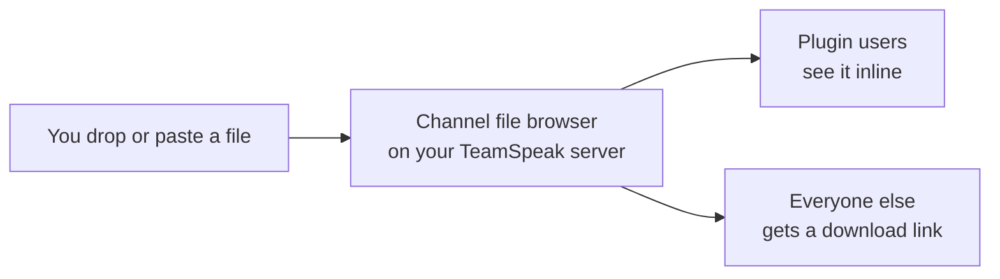

# TS Media chat

**Discord-style images, GIFs, videos and files in the TeamSpeak 3 chat**

For TeamSpeak 3.6.x on Windows 10 and 11 · Free to use · Not for TeamSpeak 5 or 6

No cloud · No telemetry · Files stay on your TeamSpeak server

[Install](#install) · [Server admins](#server-admin-guide) · [FAQ](docs/FAQ.md) · [Changelog](CHANGELOG.md)

<picture>
  <source media="(prefers-color-scheme: dark)" srcset="docs/images/hero-dark.png">
  
</picture>

**TS Media chat** is a plugin for the TeamSpeak 3 client on Windows. Drop a file on the chat or paste a screenshot, and everyone with the plugin sees it right in the chat.

## Why TS Media chat

- **Send anything.** Drag & drop files, paste a screenshot with Ctrl+V, or pick files from a menu.
- **See it inline.** Photos and animated GIFs appear in the chat, sized before they load.
- **Watch without leaving the chat.** Videos play inline with play/pause, a seek bar and mute.
- **Browse every item.** A gallery viewer with zoom, a full video player and keyboard shortcuts.
- **Works for everyone.** People without the plugin get a normal TeamSpeak download link.
- **Stays on your server.** Files go to the channel's file browser, never to a cloud service.

## Install

1. Download **`TSMedia-<version>.ts3_plugin`** from the [latest release](https://github.com/Metihttp/Teamspeak_Media_chat/releases/latest).
2. Close TeamSpeak, then double-click the file. TeamSpeak's own installer opens and shows the author **MehdiHttp**: that is this project (GitHub [@Metihttp](https://github.com/Metihttp)). Click **Install**, and answer **Yes** when it asks whether to activate the add-on.
3. Start TeamSpeak again and type `/tsmedia` in the chat. The plugin replies with its version and commands.

If nothing happens, enable the plugin in **Tools → Options → Addons**.

**Requirements:** TeamSpeak 3 Client 3.6.x on Windows 10 or 11; TeamSpeak 5 and 6 are not supported. The package contains a 64-bit and a 32-bit DLL; the 32-bit one is untested. Your server group needs file transfer permissions ([server admin guide](#server-admin-guide)). H.264 videos (most .mp4 files) play out of the box; other formats may need a video extension from the Microsoft Store ([FAQ](docs/FAQ.md#a-video-doesnt-play)).

<b>Update, uninstall and portable installs</b>

- **Update:** download the new `.ts3_plugin`, close TeamSpeak completely (the old DLL is locked while TeamSpeak runs), double-click the new file and start TeamSpeak again. Your settings and the cache are kept.
- **Disable or uninstall:** use **Tools → Options → Addons**. To do it by hand, close TeamSpeak and delete `tsmedia_win64.dll` and `tsmedia_win32.dll` from `%APPDATA%\TS3Client\plugins`. To remove the settings and the cache too, delete `%APPDATA%\TS3Client\plugins\tsmedia`. Files you have sent stay on the TeamSpeak servers; delete them in the channel's file browser if needed.
- **Portable TeamSpeak:** a portable installation uses the `config` folder inside the TeamSpeak folder instead of `%APPDATA%\TS3Client`.

## How it works

The file is uploaded with TeamSpeak's own file transfer into the channel you are in, and an ordinary TeamSpeak file link is posted. People with the plugin see the media in its place. People without it see the link and a short grey note, *TS Media chat plugin required to view this in chat*, that links to this page; clicking the link downloads the file as usual.

<picture>
  <source media="(prefers-color-scheme: dark)" srcset="docs/images/with-without-dark.png">
  
</picture>

## Send files

- **Drag & drop** files onto the chat. While you drag, the chat shows where the files will go (or why they can't be sent there). A drop opens the send window; hold <kbd>Ctrl</kbd> to send right away, or <kbd>Shift</kbd> to get TeamSpeak's normal behaviour.
- **Paste** a screenshot or copied files into the chat input with <kbd>Ctrl</kbd>+<kbd>V</kbd>. The send window shows what will be sent and where, with a preview or thumbnails, a caption field and *Mark as spoiler*. Nothing is sent until you click **Send**.
- **Crop and draw** before sending: **Edit…** in the send window crops and rotates a picture, adds arrows, frames, lines and text, and pixelates or blacks out what others shouldn't see. The edited copy is sent without its photo metadata (no location); unedited photos are sent as they are. See [Editing a picture](docs/USAGE.md#editing-a-picture).
- **Menu:** **Plugins → TS Media chat → Send files to chat…** (available while you are connected).
- **Hotkeys:** assign *Send files to the current chat* and *Cancel all uploads* in **Tools → Options → Hotkeys**.
- **Commands:** type `/tsmedia send`, or `/tsmedia cancel` to stop running uploads. `/tsmedia help` lists the commands.

The message goes to the chat tab you are looking at; the file is stored in the channel you are in. A panel at the bottom of the chat shows the progress, and a failed upload can be retried from there. More in the [usage guide](docs/USAGE.md#sending-files).

## View media

- **Photos and GIFs** up to 15 MB load automatically (the limit is a setting). Larger ones load when you click them.
- **Videos** show a poster with their duration. Press play to download the video and play it right in the chat. A video Windows can't play inside the chat says *Opens in default app*.
- **Other files** appear as cards. Click one to download it and open it with its default app. Point at a card to see the full name, size and status.
- **The gallery viewer** opens when you click a photo or GIF, or a video's expand button: every media item of the chat, with zoom and full screen.

  

Right-click any preview for Open, Save as…, Copy image, Copy link, Show in folder and more. See the [right-click menu and viewer shortcuts](docs/USAGE.md#right-click-menu).

## Settings

  

Open the settings with **Plugins → TS Media chat → Settings…**, `/tsmedia settings`, or the plugin's Settings button in **Tools → Options → Addons**. The options people change most:

- **Download images and GIFs automatically up to** (15 MB). Videos only download when you press play, unless you set *Download videos automatically*.
- **Send files dropped on the chat** and **Send screenshots and files pasted into the chat input (Ctrl+V)** (both on). Turn them off if a drop or paste should never send anything.
- **Add a note after files you send** (on): the grey note after your link, under *Note for people without the plugin*.

All options, defaults and ranges: [settings reference](docs/SETTINGS.md).

## Server admin guide

The plugin uses TeamSpeak's own file transfer. **If a user can upload and download files in a channel with the file browser, the plugin works for them.** Nothing has to be installed or configured on the server, only permissions:

| Permission | Needed for | Rule |
| --- | --- | --- |
| `i_ft_file_upload_power` | sending (uploading) | at least the channel's `i_ft_needed_file_upload_power` |
| `i_ft_file_download_power` | seeing media inline, downloading | at least the channel's `i_ft_needed_file_download_power` |
| `i_ft_directory_create_power` | creating `/tsmedia` and `/tsmedia/previews` | at least the channel's `i_ft_needed_directory_create_power`; without it, files go to the channel root |

> [!WARNING]
> On a default TeamSpeak server, the **Guest** server group cannot upload. New users can't send anything until you grant `i_ft_file_upload_power` to Guest or to the group your members are in.

Grant them in **Permissions → Server Groups → File Transfer**. Uploading to password-protected channels is not supported, and clients must reach the server's file transfer port (TCP 30033 by default). The [full server admin guide](docs/SERVER-ADMIN.md) covers step-by-step setup, ServerQuery, quotas and housekeeping.

## Privacy & security

- **Your files stay on your TeamSpeak server.** No cloud, no web requests, no telemetry.
- **Channel members can open what you send.** Anyone with download permission in that channel can; files stay until someone deletes them.
- **Nothing is sent by accident.** Ctrl+V and drops open the send window first; hold Shift while dropping to get TeamSpeak's normal behaviour.
- **Received programs are never run.** `.exe` files, scripts and other runnable files are only shown in Explorer.
- **Chat links are treated as untrusted.** Sizes, previews and names are checked, and huge images are never decoded.

The DLL is not code-signed. If you prefer, [build it yourself](docs/BUILDING.md). All details: [privacy & security](docs/PRIVACY-SECURITY.md).

## Troubleshooting

<b>TeamSpeak shows "Bad Image" with error status <code>0xc0000020</code></b>

Windows considers the plugin DLL damaged, usually by an antivirus product or an incomplete download. Close TeamSpeak and reinstall a fresh download. If it happens again, add an antivirus exclusion for `%APPDATA%\TS3Client\plugins`.

<b>A video doesn't play</b>

H.264 (most .mp4 files) works out of the box. HEVC, VP9 and AV1 need the matching extension from the Microsoft Store, and Windows N editions need the Media Feature Pack. [Details in the FAQ](docs/FAQ.md#a-video-doesnt-play).

<b>Other people don't see my images in the chat</b>

They need the plugin too, and download permission in that channel. Without the plugin they see the link and the note.

<b>A preview says "No permission to download"</b>

Your server group lacks the file transfer permissions. Show the [server admin guide](#server-admin-guide) to your server admin.

More answers in the [FAQ](docs/FAQ.md).

## Build from source

You need Visual Studio 2022 Build Tools, Qt 5.15.2, Git and Python 3; one script builds the package. See [building from source](docs/BUILDING.md) and the [architecture overview](docs/ARCHITECTURE.md).

## Support

Found a bug? Check the [FAQ](docs/FAQ.md), then [open a bug report](https://github.com/Metihttp/Teamspeak_Media_chat/issues/new?template=bug_report.yml) with what happened. Type `/tsmedia diag` in the chat and press *Copy* to get the versions, settings and recent plugin messages for the report's *Diagnostic info* box (file names are hidden unless you include them).

## License and credits

Copyright (c) 2026 MehdiHttp. All rights reserved.

This project is **not open source** and comes with no open-source license. The source code is published for transparency and reference. You are welcome to install and use the official releases, but copying, modifying or redistributing the code or the built files requires the author's permission (apart from what GitHub's Terms of Service allow, such as viewing and forking on GitHub).

- Author: **MehdiHttp** (GitHub [@Metihttp](https://github.com/Metihttp)).
- [BlurHash](https://github.com/woltapp/blurhash) by Wolt (MIT License), ported in `src/blurhash.cpp`.
- [TeamSpeak 3 Client Plugin SDK](https://github.com/teamspeak/ts3client-pluginsdk), copyright TeamSpeak Systems GmbH, included as a git submodule and not covered by this project's copyright.
- Qt 5.15 (The Qt Company), loaded from the TeamSpeak installation at runtime; Windows Media Foundation (Microsoft) for video.
- TeamSpeak is a trademark of TeamSpeak Systems GmbH; Discord is a trademark of Discord Inc. This project is not affiliated with or endorsed by either of them.
