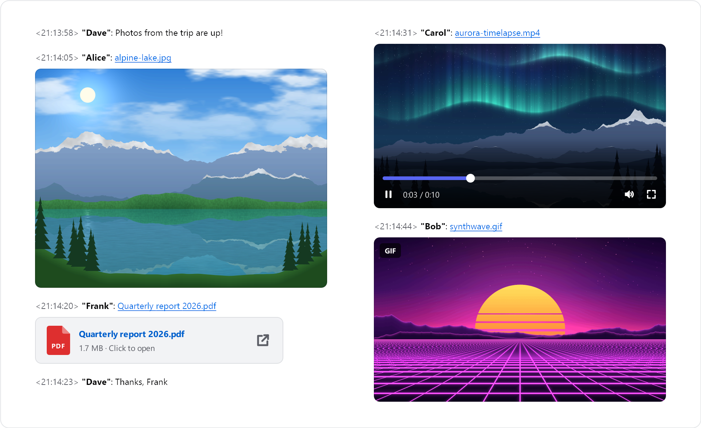
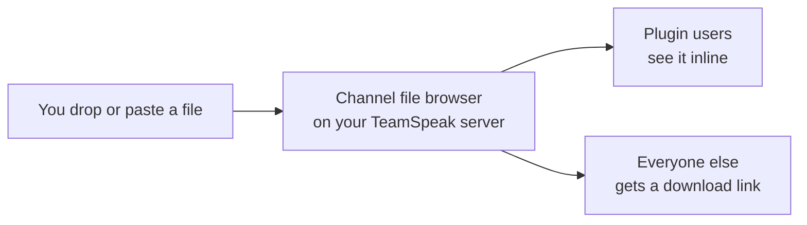
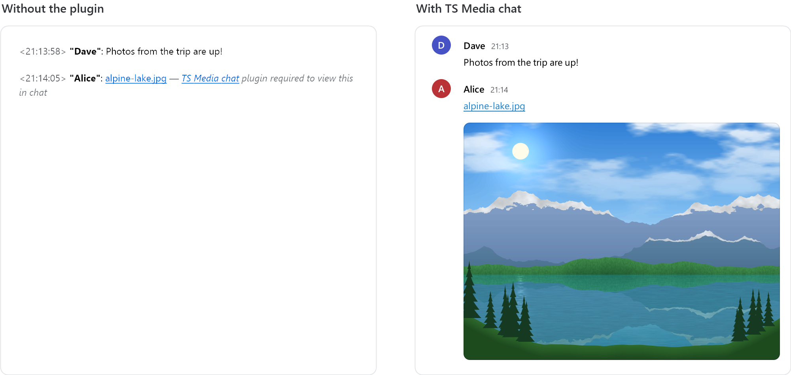
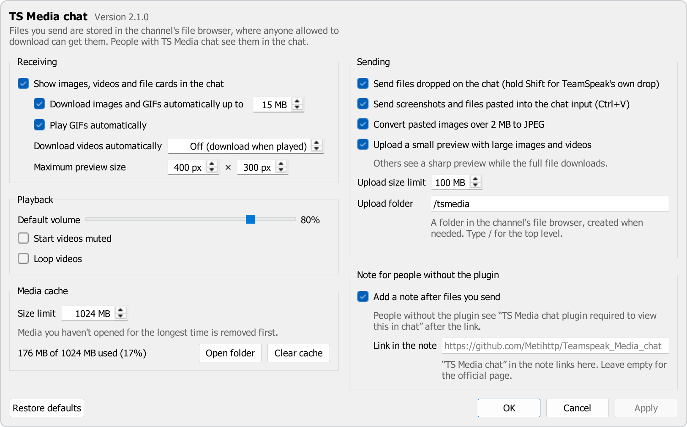

# TS Media chat

**Discord-style images, GIFs, videos, voice messages and files in the TeamSpeak 3 chat**

For TeamSpeak 3.6.x on Windows 10 and 11 · Free to use · Not for TeamSpeak 5 or 6

No cloud · No telemetry · Files stay on your TeamSpeak server

[Install](#install) · [User guide](docs/USAGE.md) · [Server admins](#server-admin-guide) · [FAQ](docs/FAQ.md) · [Changelog](CHANGELOG.md)

<picture>
  <source media="(prefers-color-scheme: dark)" srcset="docs/images/hero-dark.png">
  
</picture>

**TS Media chat** is a plugin for the TeamSpeak 3 client on Windows. Drop a file on the chat, paste a screenshot or record a voice message, and everyone with the plugin sees it right in the chat.

## Why TS Media chat

- **Send anything.** Drag & drop, paste with Ctrl+V or pick files, with a caption, spoilers or as an album.
- **See and play it inline.** Photos, GIFs, album grids, videos, audio and voice messages, right in the chat.
- **React.** Six reactions under pictures, videos and audio.
- **Browse every item.** A gallery viewer with zoom, a full video player and keyboard shortcuts.
- **Works for everyone.** People without the plugin get a normal TeamSpeak download link.
- **Stays on your server.** Files go to the channel's file browser, never to a cloud service.
- **Keeps itself up to date.** If you agree, signed updates from GitHub install with one click.

## Install

1. Download **`TSMedia-<version>.ts3_plugin`** from the [latest release](https://github.com/Metihttp/Teamspeak_Media_chat/releases/latest).
2. Close TeamSpeak, then double-click the file. TeamSpeak's own installer opens and shows the author **MehdiHttp**: that is this project (GitHub [@Metihttp](https://github.com/Metihttp)). Click **Install**, and answer **Yes** when it asks whether to activate the add-on.
3. Start TeamSpeak again and type `/tsmedia` in the chat. The plugin replies with its version and commands.

If nothing happens, enable the plugin in **Tools → Options → Addons**.

**Requirements:** TeamSpeak 3 Client 3.6.x on Windows 10 or 11; TeamSpeak 5 and 6 are not supported. The package contains a 64-bit and a 32-bit DLL; the 32-bit one is untested. Your server group needs file transfer permissions ([server admin guide](#server-admin-guide)). H.264 videos (most .mp4 files) play out of the box; other formats may need a video extension from the Microsoft Store ([FAQ](docs/FAQ.md#a-video-doesnt-play)).

<b>Updates, uninstall and portable installs</b>

- **Updates:** from 2.2.0 on, the plugin asks once whether to check GitHub for updates, then asks before installing each one ([how updates work](docs/UPDATES.md)). From 2.1 or older, install 2.2.0 by hand once: close TeamSpeak, double-click the new `.ts3_plugin`. Settings and the cache are kept.
- **Uninstall:** use **Tools → Options → Addons**, or close TeamSpeak and delete `tsmedia_win64.dll` and `tsmedia_win32.dll` from `%APPDATA%\TS3Client\plugins`; delete the `tsmedia` folder there to remove the settings, cache and log too. Sent files stay on the servers.
- **Portable TeamSpeak:** uses the `config` folder inside the TeamSpeak folder instead of `%APPDATA%\TS3Client`.

## How it works

The file is uploaded with TeamSpeak's own file transfer into the channel you are in, and an ordinary TeamSpeak file link is posted. People with the plugin see the media in its place. People without it see the link and a short grey note, *TS Media chat plugin required to view this in chat*, that links to this page.

<picture>
  <source media="(prefers-color-scheme: dark)" srcset="docs/images/with-without-dark.png">
  
</picture>

## Send files

Drop files on the chat, press <kbd>Ctrl</kbd>+<kbd>V</kbd> in the chat input, or use **Plugins → TS Media chat → Send files to chat…** (also `/tsmedia send` and a hotkey). The send window opens; nothing is sent until you click **Send**. Hold <kbd>Ctrl</kbd> while dropping to send right away, or <kbd>Shift</kbd> for TeamSpeak's own drop.

  

- **Caption** (up to 300 characters), **Mark as spoiler** per item, and **Send as an album** for 2 to 10 pictures and videos.
- **Edit…** crops a picture, draws on it and pixelates or blacks out details. Edited copies are sent without photo metadata; unedited photos are sent as they are.
- **Quality:** videos over 25 MB become a 720p MP4 on your computer before the upload. *Original* sends the file as it is.
- **Who will see it:** *3 of 5 people here will see it in the chat. The others get a download link.*

The file is stored in the channel you are in; the message goes to the chat tab you are looking at. More in the [user guide](docs/USAGE.md#sending-files).

## View media

- **Photos and GIFs** up to 15 MB load automatically; larger ones when you click them.
- **Albums** show as one grid. **Spoilers** stay blurred until clicked.
- **Videos and audio files** play inline. Other files appear as cards that open in their default app.
- **Reactions:** click the round button on a picture, or right-click → **Add reaction**.
- **Checked downloads:** a file that differs from the one that was sent is blocked (*File doesn't match what was sent*).

<picture>
  <source media="(prefers-color-scheme: dark)" srcset="docs/images/album-dark.png">
  
</picture>

Clicking a photo opens the **gallery viewer**. Right-click a preview for Save as…, Copy file and more, or drag it out into a folder ([right-click menu and shortcuts](docs/USAGE.md#right-click-menu)).

## Voice messages

<picture>
  <source media="(prefers-color-scheme: dark)" srcset="docs/images/voice-dark.png">
  
</picture>

Use **Plugins → TS Media chat → Record voice message…**, `/tsmedia voice` or a hotkey. Record up to 5 minutes, listen, then send. Your TeamSpeak microphone is muted while you record, so voice activation doesn't send you live (a setting). [More about voice messages](docs/USAGE.md#voice-messages).

## Settings

  

Open them with **Plugins → TS Media chat → Settings…** or `/tsmedia settings`. Most changed:

- **Download images, GIFs and voice messages automatically up to** (15 MB). Videos and audio download when played.
- **Data saver:** pause automatic downloads everywhere, or on one server.
- **When you drop files on the chat:** *Open the send window* or *Send right away*.
- **Compress videos larger than** (on, 25 MB).

All options: [settings reference](docs/SETTINGS.md).

## Server admin guide

The plugin uses TeamSpeak's own file transfer. **If a user can upload and download files in a channel with the file browser, the plugin works for them.** Nothing has to be installed on the server, only permissions.

**One-click group:** as a server admin, open **Settings → Servers → Server access** and click **Create TS Media chat group**. It creates a `tsmediachat` server group with an icon and the file permissions. Then right-click a user → **TS Media chat → Give TS Media chat access**.

**By hand**, grant these in **Permissions → Server Groups → File Transfer**:

| Permission | Needed for | Rule |
| --- | --- | --- |
| `i_ft_file_upload_power` | sending (uploading) | at least the channel's `i_ft_needed_file_upload_power` |
| `i_ft_file_download_power` | seeing media inline, downloading | at least the channel's `i_ft_needed_file_download_power` |
| `i_ft_directory_create_power` | creating `/tsmedia` and `/tsmedia/previews` | at least the channel's `i_ft_needed_directory_create_power`; without it, files go to the channel root |

> [!WARNING]
> On a default TeamSpeak server, the **Guest** server group cannot upload. New users can't send anything until they get the `tsmediachat` group or `i_ft_file_upload_power`.

Password-protected channels are not supported, and clients must reach the file transfer port (TCP 30033 by default). The [full server admin guide](docs/SERVER-ADMIN.md) covers the group's permissions, ServerQuery, quotas and housekeeping.

## Privacy & security

- **Your files stay on your TeamSpeak server.** No cloud, no telemetry.
- **The only web request is the update check**, to GitHub, and only after you turn it on.
- **Your channel sees that you have TS Media** (and its version), and your reactions. Both go through TeamSpeak only and can be turned off in **Settings → Privacy & updates**.
- **The microphone is only on** while the *Voice message* window shows *Recording*.
- **Channel members can open what you send.** Files stay until someone deletes them.
- **Received programs are never run**, only shown in Explorer.
- **Chat links are treated as untrusted.** Sizes, previews, names and checksums are checked.

The DLL is not code-signed; updates are checked against the author's own signature. All details: [privacy & security](docs/PRIVACY-SECURITY.md).

## Troubleshooting

<b>TeamSpeak shows "Bad Image" with error status <code>0xc0000020</code></b>

Windows considers the plugin DLL damaged, usually by an antivirus product or an incomplete download. Close TeamSpeak and reinstall a fresh download. If it happens again, add an antivirus exclusion for `%APPDATA%\TS3Client\plugins`.

<b>Dropping files opens a window instead of sending</b>

That is the send window, new in 2.2. Hold <kbd>Ctrl</kbd> while dropping to send right away, or choose *Send right away* in **Settings → Sending → When you drop files on the chat**.

<b>A video doesn't play</b>

H.264 (most .mp4 files) works out of the box. HEVC, VP9 and AV1 need the matching extension from the Microsoft Store, and Windows N editions need the Media Feature Pack. [Details in the FAQ](docs/FAQ.md#a-video-doesnt-play).

More answers in the [FAQ](docs/FAQ.md).

## Build from source

You need Visual Studio 2022 Build Tools, Qt 5.15.2, Git and Python 3; one script builds the package. Copies you build yourself never update themselves. See [building from source](docs/BUILDING.md) and the [architecture overview](docs/ARCHITECTURE.md).

## Support and feedback

Found a bug? Check the [FAQ](docs/FAQ.md), then [open a bug report](https://github.com/Metihttp/Teamspeak_Media_chat/issues/new?template=bug_report.yml). Type `/tsmedia diag` in the chat and press *Copy* to get the versions, settings and recent plugin messages for its *Diagnostic info* box (file names are left out unless you include them).

Ideas, suggestions or questions? Message me on Telegram: [@metii](https://t.me/metii).

## License and credits

Copyright (c) 2026 MehdiHttp. All rights reserved.

This project is **not open source** and comes with no open-source license. The source code is published for transparency and reference. You are welcome to install and use the official releases, but copying, modifying or redistributing the code or the built files requires the author's permission (apart from what GitHub's Terms of Service allow, such as viewing and forking on GitHub).

- Author: **MehdiHttp** (GitHub [@Metihttp](https://github.com/Metihttp), Telegram [@metii](https://t.me/metii))
- [BlurHash](https://github.com/woltapp/blurhash) by Wolt (MIT License), ported in `src/blurhash.cpp`.
- [TeamSpeak 3 Client Plugin SDK](https://github.com/teamspeak/ts3client-pluginsdk), copyright TeamSpeak Systems GmbH, included as a git submodule and not covered by this project's copyright.
- Qt 5.15 (The Qt Company), loaded from the TeamSpeak installation at runtime; Windows Media Foundation (Microsoft) for video, audio and voice messages.
- TeamSpeak is a trademark of TeamSpeak Systems GmbH; Discord is a trademark of Discord Inc. This project is not affiliated with or endorsed by either of them.
