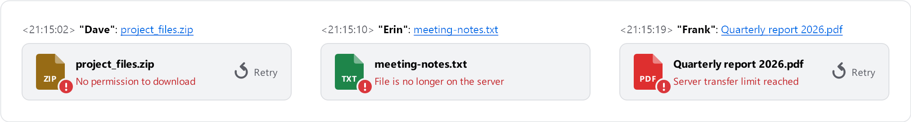

# FAQ and troubleshooting

[← Back to README](../README.md)

Answers to common questions, grouped by topic. Each question has its own link, so you can share it.

- [Install and updates](#install-and-updates)
- [Sending](#sending)
- [Viewing and playback](#viewing-and-playback)
- [Permissions](#permissions)
- [Compatibility](#compatibility)
- [Storage](#storage)

## Install and updates

### TeamSpeak shows "Bad Image" with error status `0xc0000020`

Windows considers the plugin DLL damaged. Usually an antivirus product quarantined or modified it, or the download was incomplete. Close TeamSpeak, download the package again from the [releases page](https://github.com/Metihttp/Teamspeak_Media_chat/releases/latest) and reinstall it. If it happens again, add an exclusion for `%APPDATA%\TS3Client\plugins` in your antivirus. The DLL is not code-signed, so some antivirus heuristics may flag it.

### The plugin doesn't show up in TeamSpeak

Check that you run TeamSpeak 3.6.x and that the plugin is enabled in **Tools → Options → Addons**. The TeamSpeak log (`%APPDATA%\TS3Client\logs`) should contain a line like `TS Media chat 2.1.0 loaded`.

### How do I update?

Download the new `.ts3_plugin`, close TeamSpeak completely (the old DLL is locked while TeamSpeak runs), double-click the new file and start TeamSpeak again. Your settings and the cache are kept.

### Does it work with 32-bit TeamSpeak?

The package includes a 32-bit DLL, but it hasn't been tested on a real 32-bit client yet. If you try it, please report the result in the [issues](https://github.com/Metihttp/Teamspeak_Media_chat/issues).

## Sending

### Files end up in the channel root instead of `/tsmedia`

Your server group doesn't have `i_ft_directory_create_power`, so the plugin can't create the folder. Ask your server admin, or see the [server admin guide](SERVER-ADMIN.md#permissions).

### I can't send files in a password-protected channel

Sending files to password-protected channels isn't supported. Use another channel.

### "This file is larger than your 100 MB upload limit"

Raise *Upload size limit* in **Settings → Sending** (up to 4096 MB). The server's transfer quotas still apply.

### Nothing happens when I send in a private chat

If the plugin can't tell who the private chat is with (for example, they left the server), it sends nothing and says so in the chat. This makes sure something meant for one person never ends up in the channel.

### I don't want Ctrl+V or dropping files to send anything

Both can be turned off in **Settings → Sending**. For a single drop, hold <kbd>Shift</kbd> while dropping.

## Viewing and playback

### A video doesn't play

Inside the chat, a video that Windows can't play shows *Opens in default app* and opens in your default video app when you click it. The gallery viewer names the missing decoder and offers **Get it from Microsoft Store** when there is an extension for it; an audio file it can't play says *This audio file can't be played here*. H.264 (most .mp4 files) works out of the box. For the others, install the matching extension from the Microsoft Store:

| Format | Extension to install |
| --- | --- |
| HEVC (H.265) | HEVC Video Extensions |
| VP9 (many .webm files) | VP9 Video Extensions |
| AV1 | AV1 Video Extension |
| MPEG-2 | MPEG-2 Video Extension |

Windows N editions (for example Windows 11 Pro N) need the **Media Feature Pack**. Formats Windows can't decode at all (ProRes, DNxHD, …) can still be opened with right-click → *Open with default app*.

### GIFs only play when I point at them

Either *Play GIFs automatically* is off in **Settings → Receiving**, or Windows animations are turned off (**Settings → Accessibility → Visual effects → Animation effects**). The plugin follows that Windows setting: GIFs then play only while the pointer is over them, and loading indicators stand still.

### Pictures look smaller at 100% in the viewer

Since 2.1.0, 100% in the gallery viewer shows one image pixel per screen pixel. On a display scaled to 125%, 150% or more, that is smaller than in apps that scale pictures up. *Fit* still fits the picture into the window, but never enlarges it.

### Other people don't see my images in the chat

They need the plugin too, and download permission in that channel. Without the plugin they see the link and the note, and can click the link to download the file.

### A preview says "Not connected to this server"

The file is on a server you are not connected to, for example after a disconnect. Reconnect and click the preview. Downloads interrupted by a lost connection resume by themselves once you are back.

### What do the messages on a preview mean?

<picture>
  <source media="(prefers-color-scheme: dark)" srcset="images/errors-dark.png">
  
</picture>

When a download fails, the preview or card says why:

| Message | What it means | What to do |
| --- | --- | --- |
| No permission to download | Your server group may not download files in this channel. | Ask a server admin ([permissions](#no-permission-to-download)). |
| File is no longer on the server | The file was deleted from the server, or replaced after it was sent. | Ask the sender to send it again. |
| Channel is password protected | The file is stored in a password-protected channel. | Use TeamSpeak's file browser. |
| Not connected to this server | You are not connected to the server the file is on. | Reconnect; the download resumes. |
| Server transfer limit reached | The server's file transfer quota is used up. | Ask a server admin. |
| Download failed | Something else went wrong. | Click the preview to try again. |
| Can't preview this image | The image is too large to decode (above 80 megapixels) or can't be read. | Click it, then choose **Open with default app**. |

Deleted files and files in password-protected channels can't be retried: their previews show the normal pointer and do nothing when clicked. For everything else, click the picture or the card's **Retry** button to try again. Point at a card to read the whole message.

## Permissions

### "No permission to download"

Your server group lacks the file transfer permissions (`i_ft_file_download_power`). Show the [server admin guide](SERVER-ADMIN.md) to your server admin.

### "You don't have permission to upload files in this channel"

Your server group lacks `i_ft_file_upload_power`. On a default TeamSpeak server the Guest group cannot upload, so new users hit this first. A server admin has to grant the permission; see the [server admin guide](SERVER-ADMIN.md#granting-permissions-in-the-teamspeak-client).

## Compatibility

### Does it work with TeamSpeak 5 or TeamSpeak 6?

No. They don't load TeamSpeak 3 plugins. The plugin is made for TeamSpeak 3.6.x.

### macOS or Linux?

No, the plugin is Windows only.

## Storage

### The cache takes too much space

Lower the *Size limit* or click **Clear cache** in **Settings → Media cache**. Media still in the chat is downloaded again when needed.

### Where are my settings and the cache?

In `%APPDATA%\TS3Client\plugins\tsmedia`: `settings.ini` and the `cache` folder. Type `/tsmedia cache` to open the cache folder. A portable TeamSpeak uses the `config` folder inside the TeamSpeak folder instead of `%APPDATA%\TS3Client`.
