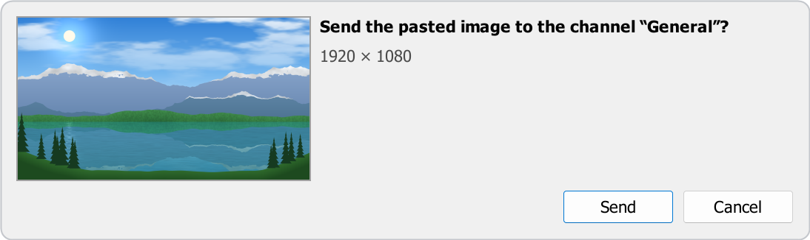

# Using TS Media chat

[← Back to README](../README.md)

How to send files, what you see in the chat, how the gallery viewer works, and the chat commands.

## Sending files

| Method | How |
| --- | --- |
| Drag & drop | Drop files on the chat messages or the chat input. The send window opens; hold <kbd>Ctrl</kbd> while dropping to send them right away. |
| Paste | Press <kbd>Ctrl</kbd>+<kbd>V</kbd> in the chat input. The send window opens. |
| Menu | **Plugins → TS Media chat → Send files to chat…** (greyed out while the current server tab is not connected) |
| Hotkey | Set it up once in **Tools → Options → Hotkeys** (see below). |
| Chat command | `/tsmedia send` |

- **Drag & drop:** you can drop one or more files at once. While you drag, the chat shows *Drop to send …*, where the files will go and what the drop does, or *Can't send files here* and the reason. A drop opens the send window; hold <kbd>Ctrl</kbd> while dropping to send right away instead (the setting *When you drop files on the chat* turns this round). Hold <kbd>Shift</kbd> while dropping to get TeamSpeak's normal behaviour. Drags from TeamSpeak's own file browser keep working as before, and files dragged out of the chat are never sent again.
- **Paste:** take a screenshot (for example with <kbd>Win</kbd>+<kbd>Shift</kbd>+<kbd>S</kbd>) or copy files in Explorer, click the chat input and press <kbd>Ctrl</kbd>+<kbd>V</kbd>. Plain text still pastes as usual. Text you already typed in the chat input becomes the caption; it is removed from the input once the files are sent, and stays there if you cancel.
- **Hotkeys:** in **Tools → Options → Hotkeys**, click **Add**, then **Show Advanced Actions**, and pick **Plugins → Plugin Hotkey → TS Media chat → Send files to the current chat**. **Cancel all uploads** is there too.

Before the file picker opens, before the send window and when you drop files, the plugin checks that you are connected, that your channel has no password and that it knows who a private chat is with. If something is missing, it says why (next to where you are and in the chat), and nothing is sent.

Drag & drop and Ctrl+V sending can each be turned off in the [settings](SETTINGS.md#sending).

### Where a message goes

- The message goes to the chat tab you are looking at: channel, server or a private chat. The file itself is always stored in the file browser of **the channel you are currently in**.
- If the partner of a private chat can't be identified (for example, they left the server), nothing is sent. Something meant for one person never ends up in the channel instead.
- When you send several files at once, their messages appear in the chat in the order you chose the files. Up to two files upload at the same time; the others wait their turn.
- Messages from the plugin itself (an upload failed, a command's answer) appear in the chat tab you are looking at.

### The send window

<!-- TODO(2.2): replace with a screenshot of the send window. -->

  

Pasting, dropping and the file picker all open the same window. It names where the files go (the channel, the whole server or a private chat) and shows what will be sent: a large preview for one picture or video, or a list with a thumbnail, the name and the size of each file. Nothing is sent until you click **Send** (or press <kbd>Enter</kbd>); <kbd>Esc</kbd> closes it, and asks first if you changed something.

- **Caption:** one line of up to 300 characters, shown in the chat right above the file (above the first one when you send several). A counter appears from 250 characters. A caption that doesn't fit in the same chat message as the file is sent as its own message right above it; it is never shortened.
- **Mark as spoiler:** pictures, GIFs and videos can be marked one by one (the eye button in the list, <kbd>S</kbd> on a focused row). People with TS Media chat see them blurred until they click. People on TS Media 2.1 or older, and people without the plugin, see them unblurred.
- **Edit…** (the pencil in the list, <kbd>E</kbd> on a focused row): crop and draw on a picture before you send it, see [Editing a picture](#editing-a-picture). The item then says *Edited*; **Revert to original** (the arrow next to the pencil) brings the original back. Animated GIFs and pictures over 33 megapixels (16 in 32-bit TeamSpeak) can't be edited.
- **Add files…** (<kbd>Ctrl</kbd>+<kbd>O</kbd>), dropping more files on the window, or <kbd>Ctrl</kbd>+<kbd>V</kbd> add files; the **×** button (or <kbd>Delete</kbd> on a focused row) removes one. Up to 100 files can be sent at once.
- Files that can't be sent (empty, larger than your upload limit, missing or open in another program) are marked with the reason before you click **Send**, and left out. The button says what will be sent (*Send 3 images*, *Send 5 files*). While you are not connected, or the person of a private chat has left, the window says so and **Send** stays off; what you entered is kept.

The clipboard may hold something old you forgot about, so a paste never sends anything without the window.

### Editing a picture

**Edit…** opens the picture in its own window. Nothing changes the original file: the edited picture is a new copy, and you can open the editor again to change or undo what you did.

| Tool | Key | What it does |
| --- | --- | --- |
| Crop | <kbd>C</kbd> | Drag the frame or its corners. *Free*, *Original*, *Square*, *4:3* and *16:9* set the shape, **Swap** (<kbd>X</kbd>) turns it between landscape and portrait, **Rotate** (<kbd>Ctrl</kbd>+<kbd>R</kbd>) turns the picture 90° clockwise, **Reset crop** shows the whole picture again. The arrow keys move the frame and <kbd>Shift</kbd>+arrows resize it. <kbd>Enter</kbd> applies the crop, <kbd>Esc</kbd> leaves it as it was. |
| Pen | <kbd>P</kbd> | Draw freehand. Hold <kbd>Shift</kbd> for a straight line. |
| Arrow | <kbd>A</kbd> | Drag from the tail to the tip. <kbd>Shift</kbd> keeps it at 45° steps. |
| Rectangle | <kbd>R</kbd> | Drag a frame. <kbd>Shift</kbd> makes a square. |
| Text | <kbd>T</kbd> | Click where the text should start, type, then <kbd>Enter</kbd>. Light colours get a dark outline and dark ones a light outline, so the text stays readable. |
| Hide details | <kbd>H</kbd> | Drag over something to hide it: *Pixelate* or *Black box*. Pixelate hides most details; for passwords, codes and addresses use *Black box*. |

- **Colours** (<kbd>1</kbd>–<kbd>6</kbd>): red, yellow, green, blue, white, black. **Sizes** (<kbd>[</kbd> and <kbd>]</kbd>): thin, medium and thick lines, or small, medium and large text. The editor remembers your last choice.
- <kbd>Ctrl</kbd>+<kbd>Z</kbd> undoes, <kbd>Ctrl</kbd>+<kbd>Y</kbd> (or <kbd>Ctrl</kbd>+<kbd>Shift</kbd>+<kbd>Z</kbd>) redoes. <kbd>Ctrl</kbd>+wheel zooms, <kbd>Ctrl</kbd>+<kbd>0</kbd> fits the window, <kbd>Ctrl</kbd>+<kbd>1</kbd> shows the picture at its actual size; hold <kbd>Space</kbd> and drag (or drag with the middle button) to move around.
- **Done** (<kbd>Enter</kbd>) keeps the edit, **Cancel** (<kbd>Esc</kbd>) asks first if you changed something.
- Lines and text keep the size you see on screen, at any zoom, and the edited picture is saved at the full resolution of what you kept (it is never enlarged).
- The edited picture keeps its name. JPEG and WebP photos are saved as JPEG (quality 92); screenshots (PNG, BMP), pasted pictures and anything with transparency as PNG, which becomes JPEG (quality 90) when it is over 2 MB without transparency and *Convert pasted images over 2 MB to JPEG* is on.
- The edited copy has no metadata: no EXIF, so no camera details and no location. Pictures you send without editing are sent as they are.

### Upload progress

  

A panel at the bottom of the chat shows each upload with its progress, in TeamSpeak's light or dark theme:

- An upload shows its percentage, the speed, the amount sent and the time left. Files waiting for their turn say *Waiting to upload…*.
- With several files, a header shows the overall progress (*2 of 5 sent*), the time left and **Cancel all**. At most four files are listed, failed ones first; the rest are summed up as *+3 more*, which you can click to see them all.
- The **×** button of a file cancels its upload, or dismisses it once it is finished.
- A failed upload says why and what to do next. It stays at least 10 seconds (15 with **Retry**), and never goes away while the pointer is on the panel. **Retry** sends the file again when that is possible (not when the file already reached the server). Every failure is also written into the chat, where it stays readable.
- `/tsmedia cancel` or the *Cancel all uploads* hotkey stop every running upload from the keyboard.

### File names and folders

- Files are uploaded as `/tsmedia/<name>_<8 random hex digits>.<ext>`, for example `/tsmedia/holiday_3f9a1c2e.jpg`. Spaces become `_`, unusual characters are replaced, the name (without the extension) is cut to 48 characters and the extension is lower-cased. The random part keeps names apart, and an existing file is never overwritten.
- Where the plugin shows a file name, it leaves the random part out (`holiday.jpg`). A pasted screenshot is called *Pasted image*.
- A pasted image is sent as `new_photo_<random>.png`, or converted to JPEG (quality 90) if it is larger than 2 MB and has no transparency.
- With *Upload a small preview* on (the default), a preview is stored as `/tsmedia/previews/<name>.jpg`. Previews are only made for photos larger than 1.5 MB or with a side longer than 2560 px (preview up to 1280 px), for animated GIFs and WebPs larger than 4 MB (first frame, up to 640 px), and for every video (poster up to 960 px).
- If the folder can't be created (no `i_ft_directory_create_power`), the file goes to the root of the channel's file browser and its preview to `/previews`, or next to the file as `<name>.preview.jpg`.
- The folder and the upload size limit (default 100 MB) can be changed in the [settings](SETTINGS.md#sending).

## Viewing media

- **Images and GIFs** up to 15 MB load automatically. Larger ones show their preview (or a blurred placeholder) with the file size, and load when you click them. Clicking an image or GIF opens the gallery viewer.
- **Videos** show their poster, a play button and the duration. Clicking play downloads the video first (a progress ring shows the percentage) and then plays it right in the chat. Hover over a playing video to show its controls: play/pause, time, seek bar, mute and expand (opens the gallery viewer). Pointing at a control shows its name, and the seek bar shows the time under the pointer. The controls stay while the pointer rests on them and fade out 2.5 s after the mouse stops elsewhere. Starting a video pauses any other.
- **Videos Windows can't play inside the chat** (a missing decoder, for example) show *Opens in default app*: clicking them opens your default video app.
- **Other files**, audio files included, appear as cards. Click a card to download the file and open it with its default Windows app. Programs and scripts are never run: their card says *Show in folder*, and clicking it shows the file in Explorer.
- **Ordinary TeamSpeak file links** (for example a file dragged from the file browser into the chat) get the same treatment, just without the dimensions, duration, blurred placeholder and preview that TS Media chat adds to its own links.
- Previews and cards light up when you point at them and when you press them. Point at a card or a failed preview to see the file's full name, size and status.
- You have to be connected to the server the file is on. Up to 3 downloads run at once, previews first. A file waiting for its turn says *Waiting to download…*.
- When something goes wrong, the reason is written on the preview or card. Failed cards have a **Retry** button, and clicking a failed picture tries again. Deleted files and files in password-protected channels can't be retried: their previews show the normal pointer and do nothing when clicked. The [FAQ](FAQ.md#what-do-the-messages-on-a-preview-mean) explains every message.
- With Windows animations turned off (**Settings → Accessibility → Visual effects → Animation effects**), GIFs play only while the pointer is over them, and loading indicators stand still.

## Right-click menu

Right-click any preview or card. The item in bold is what a click on the preview does.

| Item | Shown for |
| --- | --- |
| Play / Pause | videos (*Open in default app* for a video Windows can't play inside the chat) |
| Mute / Unmute | videos that have been started |
| Download | files that are not downloaded yet |
| Retry download | files whose download failed (not for deleted files or password-protected channels) |
| Open | everything except deleted files, files in password-protected channels, and programs and scripts (media opens in the viewer, other files in their default app) |
| Open with default app | downloaded images and videos |
| Show in folder | downloaded files |
| Save as… | downloaded files (confirms *Saved to …* with the folder's name) |
| Copy image | downloaded images and GIFs (confirms *Image copied*) |
| Copy link | always (copies the `ts3file://` link and confirms *Link copied*) |

## Gallery viewer

  

The viewer shows every media item of the chat, so you can step through them without closing it. The counter shows which item you are looking at.

- The mouse wheel zooms around the pointer, and dragging pans the image.
- Double-clicking an image switches between *fit to window* and 100%, zooming into the point you clicked (200% when the picture already fits at 100%). 100% shows one image pixel per screen pixel, so on a scaled display (125%, 150%, …) pictures look smaller at 100% than in other apps that scale them up.
- Clicking a GIF pauses or resumes it. Clicking a video plays or pauses it, and double-clicking a video toggles full screen.
- The bottom bar has **Fit**, **100%**, **Copy image** (**Copy frame** for videos and GIFs), **Save as…**, **Show in folder** and **Open with default app** (not offered for programs and scripts, which are only shown in their folder). Fit and 100% show which view is active.
- Full screen keeps a header with the name, the position in the gallery, Copy, Save, Open and Exit. The controls and the pointer hide while you don't move the mouse.
- Messages say what went wrong first and offer the way out right below: **Retry**, **Open with default app**, or **Get it from Microsoft Store** when a video needs a decoder from the Store.
- Volume changes made in the viewer are remembered.
- Images that are not downloaded yet load when you step to them. Videos wait until you press play, unless they are small enough to download automatically.
- The **?** button in the top bar (or <kbd>?</kbd> / <kbd>F1</kbd>) shows the keyboard shortcuts.

### Viewer keyboard shortcuts

| Key | Action |
| --- | --- |
| <kbd>←</kbd> / <kbd>→</kbd> | previous / next item of the gallery (seek 5 s when the video is the chat's only item) |
| <kbd>Shift</kbd>+<kbd>←</kbd> / <kbd>Shift</kbd>+<kbd>→</kbd> | seek 5 s back / forward (video); move a zoomed picture |
| <kbd>Space</kbd> or <kbd>K</kbd> | play / pause a video; pause / resume a GIF |
| <kbd>Home</kbd> | back to the start of the video |
| <kbd>M</kbd> | mute / unmute |
| <kbd>L</kbd> | loop on / off |
| <kbd>↑</kbd> / <kbd>↓</kbd> | volume up / down by 5% (video); move a zoomed picture |
| <kbd>F</kbd> | full screen |
| <kbd>Esc</kbd> | leave full screen, otherwise close the viewer |
| <kbd>0</kbd> | fit the image to the window |
| <kbd>1</kbd> | 100% (one image pixel per screen pixel) |
| <kbd>+</kbd> / <kbd>−</kbd> | zoom in / out |
| <kbd>Ctrl</kbd>+<kbd>C</kbd> | copy the image, or the current video frame |
| <kbd>Ctrl</kbd>+<kbd>S</kbd> | save as… |
| <kbd>Ctrl</kbd>+<kbd>O</kbd> | open with default app |
| <kbd>Tab</kbd> / <kbd>Shift</kbd>+<kbd>Tab</kbd> | move between the buttons |
| <kbd>Enter</kbd> | press the highlighted or focused button |
| <kbd>?</kbd> or <kbd>F1</kbd> | show the shortcut list |

Letter and number keys also work with non-Latin keyboard layouts. After a mouse click in the viewer, the keys act on the media again.

## Chat commands

| Command | What it does |
| --- | --- |
| `/tsmedia send` | pick files and send them to the current chat |
| `/tsmedia cancel` | cancel all running uploads |
| `/tsmedia settings` | open the settings |
| `/tsmedia cache` | open the media cache folder |
| `/tsmedia help` or `/tsmedia` | print the version and the list of commands |
| `/tsmedia debug` | write a list of TeamSpeak's chat widgets to `widget_dump.txt` in the plugin's data folder (`%APPDATA%\TS3Client\plugins\tsmedia`) for bug reports; the chat says *Diagnostics saved to …* |

An unknown command is named in a warning, followed by the list of commands.
