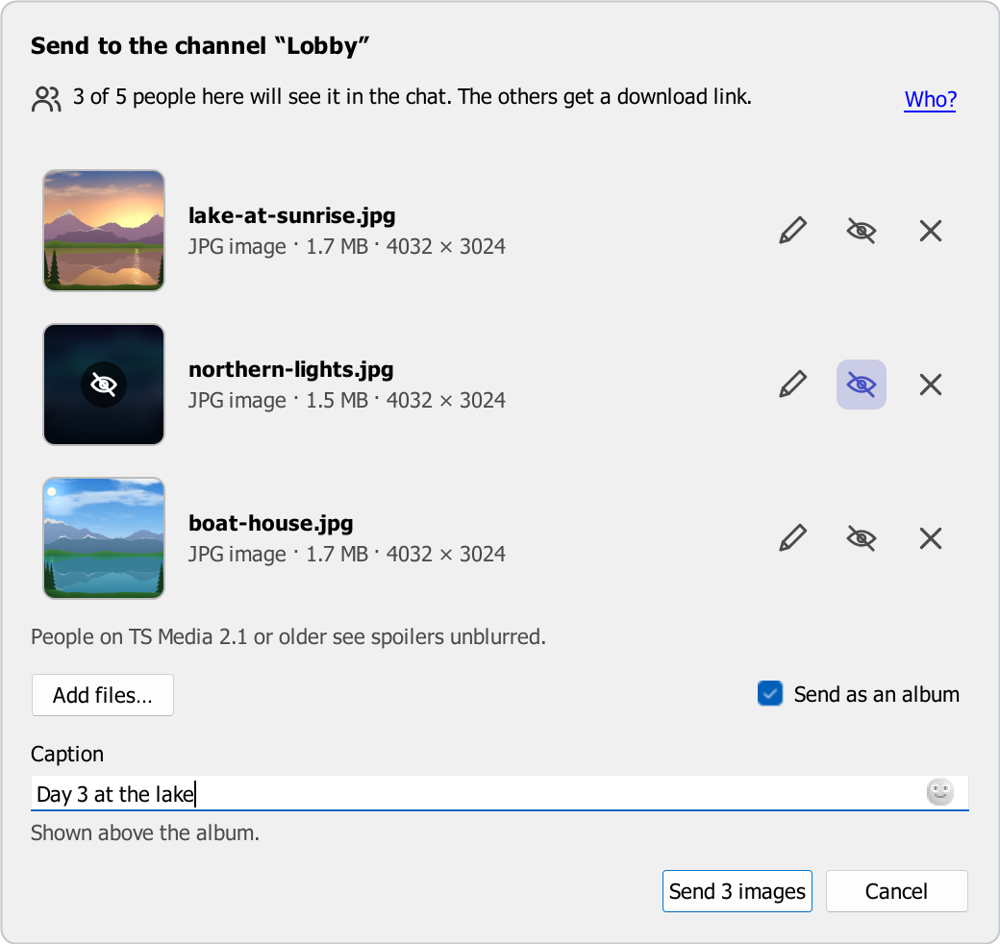
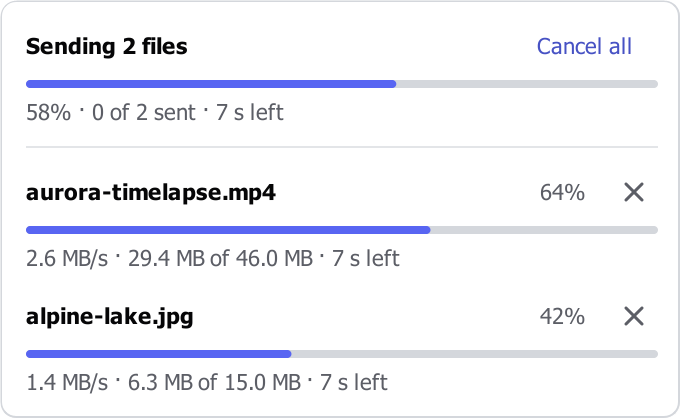
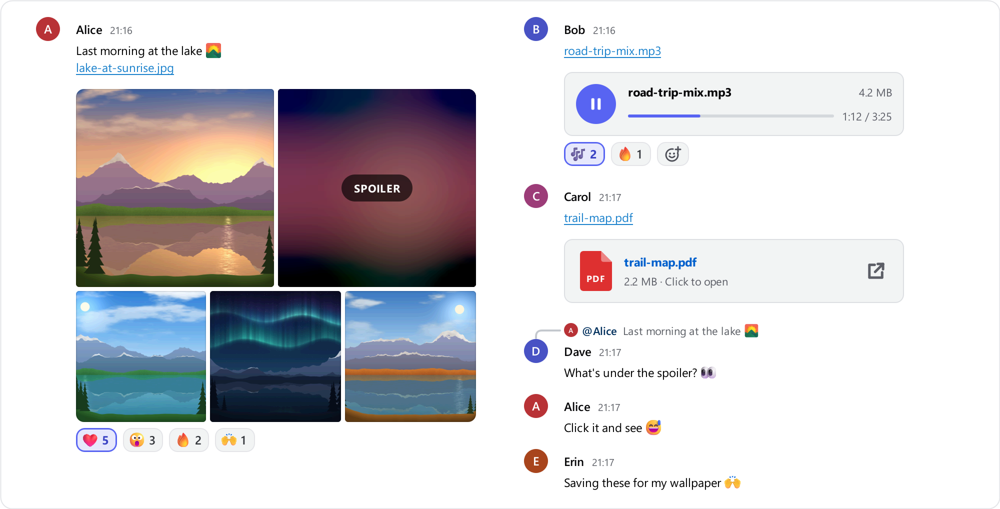
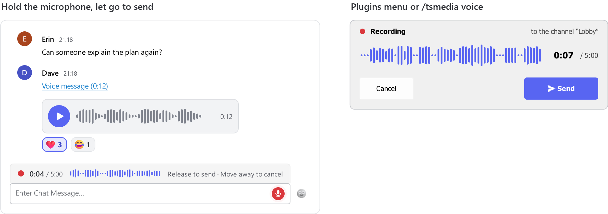
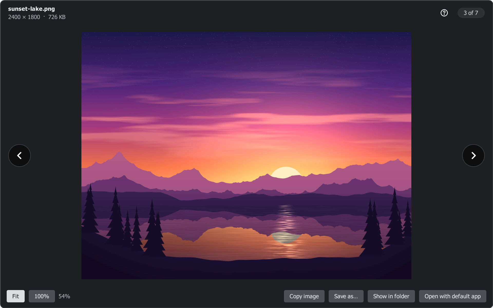

# Using TS Media chat

[← Back to README](../README.md)

How to send files and voice messages, what you see in the chat, how the gallery viewer works, and the chat commands.

- [Sending files](#sending-files): [the send window](#the-send-window), [editing a picture](#editing-a-picture), [large videos](#large-videos), [upload progress](#upload-progress), [file names and folders](#file-names-and-folders)
- [Viewing media](#viewing-media): [albums](#albums), [spoilers](#spoilers), [audio](#audio-files), [reactions](#reactions), [file checks](#file-checks), [data saver](#data-saver)
- [Voice messages](#voice-messages)
- [Dragging files out of the chat](#dragging-files-out-of-the-chat)
- [Right-click menu](#right-click-menu), [gallery viewer](#gallery-viewer), [chat commands](#chat-commands) and [hotkeys](#hotkeys)

## Sending files

| Method | How |
| --- | --- |
| Drag & drop | Drop files on the chat messages or the chat input. The send window opens; hold <kbd>Ctrl</kbd> while dropping to send them right away. |
| Paste | Press <kbd>Ctrl</kbd>+<kbd>V</kbd> in the chat input. The send window opens. |
| Menu | **Plugins → TS Media chat → Send files to chat…** (greyed out while the current server tab is not connected) |
| Hotkey | *Send files to the current chat* (see [hotkeys](#hotkeys)) |
| Chat command | `/tsmedia send` |

- **Drag & drop:** you can drop one or more files at once. While you drag, the chat shows *Drop to send …*, where the files will go and what the drop does, or *Can't send files here* and the reason. A drop opens the send window; hold <kbd>Ctrl</kbd> while dropping to send right away instead (the setting *When you drop files on the chat* turns this round). Hold <kbd>Shift</kbd> while dropping to get TeamSpeak's normal behaviour. Drags from TeamSpeak's own file browser keep working as before, and files dragged out of the chat are never sent again.
- **Paste:** take a screenshot (for example with <kbd>Win</kbd>+<kbd>Shift</kbd>+<kbd>S</kbd>) or copy files in Explorer, click the chat input and press <kbd>Ctrl</kbd>+<kbd>V</kbd>. Plain text still pastes as usual. Text you already typed in the chat input becomes the caption; it is removed from the input once the caption is in the chat, and stays there if you cancel or the send fails.

Before the file picker opens, before the send window and when you drop files, the plugin checks that you are connected, that your channel has no password and that it knows who a private chat is with. If something is missing, it says why (next to where you are and in the chat), and nothing is sent.

Drag & drop and Ctrl+V sending can each be turned off in the [settings](SETTINGS.md#sending).

### Where a message goes

- The message goes to the chat tab you are looking at: channel, server or a private chat. The file itself is always stored in the file browser of **the channel you are currently in**.
- If the partner of a private chat can't be identified (for example, they left the server), nothing is sent. Something meant for one person never ends up in the channel instead.
- When you send several files at once, albums come first, then the other files in the order you chose them. Up to two files upload at the same time; the others wait their turn.
- Messages go out one at a time and follow TeamSpeak's flood protection: when TeamSpeak asks the plugin to slow down, the upload panel says *TeamSpeak is limiting messages. Retrying…* and the message is sent again, instead of being lost.
- Messages from the plugin itself (an upload failed, a command's answer) appear in the chat tab you are looking at. If you have switched to another server's tab meanwhile, they go to the channel tab of the server they belong to.

### The send window

  

Pasting, dropping and the file picker all open the same window. It names where the files go (*Send to the channel “Lobby”*, the whole server or a private chat) and shows what will be sent: a large preview for one picture or video, or a list with a thumbnail, the name and the size of each file. Nothing is sent until you click **Send** (or press <kbd>Enter</kbd>); <kbd>Esc</kbd> closes it, and asks first if you changed something.

- **Caption:** one line of up to 300 characters, shown in the chat right above the file (above the first one, or above the album, when you send several). A counter appears from 250 characters. A caption that doesn't fit in the same chat message as the file is sent as its own message right above it; it is never shortened.
- **Mark as spoiler:** pictures, GIFs and videos can be marked one by one (the eye button in the list, <kbd>S</kbd> on a focused row). People with TS Media chat see them blurred until they click. People on TS Media 2.1 or older, and people without the plugin, see them unblurred.
- **Send as an album:** shown for two or more pictures and videos (on by default; the window remembers your choice). Up to 10 go into one album, so 12 pictures are sent as two albums (10 + 2). Other files are sent one by one.
- **Who will see it:** a line counts who in your channel has TS Media, for example *3 of 5 people here will see it in the chat. The others get a download link.* **Who?** lists the names. In a private chat it names your partner; alone in a channel it says *You're the only one in this channel. No one else will get this message.* People on TS Media 2.1 or older can't answer and count as getting a link. The line is hidden when you turned off *Tell people in your channel that you have TS Media*.
- **Edit…** (the pencil in the list, <kbd>E</kbd> on a focused row): crop and draw on a picture before you send it, see [editing a picture](#editing-a-picture). The item then says *Edited*; **Revert to original** (the arrow next to the pencil) brings the original back. Animated GIFs and pictures over 33 megapixels (16 in 32-bit TeamSpeak) can't be edited.
- **Quality** (videos): see [large videos](#large-videos).
- **Add files…** (<kbd>Ctrl</kbd>+<kbd>O</kbd>), dropping more files on the window, or <kbd>Ctrl</kbd>+<kbd>V</kbd> add files; the **×** button (or <kbd>Delete</kbd> on a focused row) removes one. Up to 100 files can be sent at once.
- Files that can't be sent (empty, larger than your upload limit, missing or open in another program) are marked with the reason before you click **Send**, and left out. The button says what will be sent (*Send 3 images*, *Send 5 files*). While you are not connected, or the person of a private chat has left, the window says so and **Send** stays off; what you entered is kept.

The clipboard may hold something old you forgot about, so a paste never sends anything without the window.

### Editing a picture

**Edit…** opens the picture in its own window. Nothing changes the original file: the edited picture is a new copy, and you can open the editor again to change or undo what you did.

| Tool | Key | What it does |
| --- | --- | --- |
| Crop | <kbd>C</kbd> | Drag the frame or its corners. *Free*, *Original*, *Square*, *4:3* and *16:9* set the shape, **Swap** (<kbd>X</kbd>) turns it between landscape and portrait, **Rotate** (<kbd>Ctrl</kbd>+<kbd>R</kbd>) turns the picture 90° clockwise, **Reset crop** shows the whole picture again. The arrow keys move the frame and <kbd>Shift</kbd>+arrows resize it. <kbd>Enter</kbd> applies the crop, <kbd>Esc</kbd> leaves it as it was. |
| Pen | <kbd>P</kbd> | Draw freehand. Hold <kbd>Shift</kbd> for a straight line. |
| Arrow | <kbd>A</kbd> | Drag from the tail to the tip. <kbd>Shift</kbd> keeps it at 45° steps. |
| Rectangle | <kbd>R</kbd> | Drag a frame. <kbd>Shift</kbd> makes a square. |
| Text | <kbd>T</kbd> | Click where the text should start, type, then <kbd>Enter</kbd>. Light colours get a dark outline and dark ones a light outline, so the text stays readable. |
| Hide details | <kbd>H</kbd> | Drag over something to hide it: *Pixelate* or *Black box*. Pixelate hides most details; for passwords, codes and addresses use *Black box*. |

- **Colours** (<kbd>1</kbd>–<kbd>6</kbd>): red, yellow, green, blue, white, black. **Sizes** (<kbd>[</kbd> and <kbd>]</kbd>): thin, medium and thick lines, or small, medium and large text. The editor remembers your last choice.
- <kbd>Ctrl</kbd>+<kbd>Z</kbd> undoes, <kbd>Ctrl</kbd>+<kbd>Y</kbd> (or <kbd>Ctrl</kbd>+<kbd>Shift</kbd>+<kbd>Z</kbd>) redoes. <kbd>Ctrl</kbd>+wheel zooms, <kbd>Ctrl</kbd>+<kbd>0</kbd> fits the window, <kbd>Ctrl</kbd>+<kbd>1</kbd> shows the picture at its actual size; hold <kbd>Space</kbd> and drag (or drag with the middle button) to move around.
- **Done** (<kbd>Enter</kbd>) keeps the edit, **Cancel** (<kbd>Esc</kbd>) asks first if you changed something.
- Lines and text keep the size you see on screen, at any zoom, and the edited picture is saved at the full resolution of what you kept (it is never enlarged).
- The edited picture keeps its name. JPEG and WebP photos are saved as JPEG (quality 92); screenshots (PNG, BMP), pasted pictures and anything with transparency as PNG, which becomes JPEG (quality 90) when it is over 2 MB without transparency and *Convert pasted images over 2 MB to JPEG* is on.
- The edited copy has no metadata: no EXIF, so no camera details and no location. Pictures you send without editing are sent exactly as they are, so a phone photo can still say where it was taken.

### Large videos

Videos larger than 25 MB, and iPhone (HEVC), AV1, VP9 or camcorder videos of any size, are converted on your computer to an MP4 (H.264 and AAC) that plays everywhere, before they are uploaded. Nothing is sent anywhere else, and a video is only compressed when that makes it at least 30% smaller.

- In the send window each video has a **Quality** list with the size each choice is expected to have: *Original*, *1080p*, *720p* and *480p* (in the large single view: *High (1080p)*, *Balanced (720p)*, *Smaller (480p)*). The default is what your [settings](SETTINGS.md#videos) say.
- A video over your upload limit gets a smaller quality that fits, picked for you; *Original* is then shown as *over the limit*. A video that can't be made small enough says why and what to do.
- While a video is compressed, the upload panel shows *Compressing · 240 MB → about 18 MB · 1 min left*, a **Send original** button (when the original fits your upload limit) and **×** to cancel. Other files of the same send keep going, and their messages still appear in the order you chose. When it is done, the panel shows *Sent · 240 MB → 18.0 MB*.
- If compressing fails, the original is sent when it fits (*Sent the original*; the panel's tooltip says why).
- The result keeps the random part of its name, with the extension `.mp4`. Extra sound tracks, subtitles and metadata (including the location some phones store in videos) are not kept.
- The graphics card does the work when it can, otherwise the processor; one video at a time, at a lower priority than TeamSpeak's own work. On Windows N editions without the Media Feature Pack, videos are sent as they are.

### Upload progress

  

A panel at the bottom of the chat shows each upload with its progress, in TeamSpeak's light or dark theme:

- An upload shows its percentage, the speed, the amount sent and the time left. Files waiting for their turn say *Waiting to upload…*; videos waiting for compression *Waiting to compress…*.
- With several files, a header shows the overall progress (*2 of 5 sent*), the time left and **Cancel all**. At most four files are listed, failed ones first; the rest are summed up as *+3 more*, which you can click to list as many as fit in the chat (*Show fewer · 2 not shown* counts the rest).
- The **×** button of a file cancels its upload, or dismisses it once it is finished. A file that is uploaded but still waits for earlier files (*Waiting for earlier files…*) or for the rest of its album (*Waiting for the rest of the album…*) can be canceled too: nothing is posted for it, it is removed from the channel's file browser again, and the album is sent without it.
- A failed upload says why and what to do next. It stays at least 10 seconds (15 with **Retry**), and never goes away while the pointer is on the panel. **Retry** sends the file again to the same chat when that is possible: not when the tab is now connected to another server or the private chat partner has left. When the file already reached the server but its message didn't (*TeamSpeak didn't confirm the chat message*), **Retry** posts the message again without uploading the file twice. Every failure is also written into the chat.
- `/tsmedia cancel` or the *Cancel all uploads* hotkey stop every running upload from the keyboard, files waiting for earlier ones included.

### File names and folders

- Files are uploaded as `/tsmedia/<name>_<8 random hex digits>.<ext>`, for example `/tsmedia/holiday_3f9a1c2e.jpg`. Spaces become `_`, unusual characters are replaced, the name (without the extension) is cut to 48 characters and 64 bytes (about 32 Persian or 21 Chinese characters), and the extension is lower-cased. The random part keeps names apart, and an existing file is never overwritten.
- Where the plugin shows a file name, it leaves the random part out (`holiday.jpg`). A pasted screenshot is called *Pasted image*. Spoilers are labelled *Spoiler (image)*, *Spoiler (GIF)* or *Spoiler (video)* in the chat link, and voice messages *Voice message (0:12)*.
- A pasted image is sent as `new_photo_<random>.png`, or converted to JPEG (quality 90) if it is larger than 2 MB and has no transparency. Voice messages are sent as `voice_message_<random>.m4a`, and compressed videos keep their name with `.mp4`.
- With *Upload a small preview* on (the default), a preview is stored as `/tsmedia/previews/<8 hex>.jpg`, with the same random part as the file. Previews are only made for photos larger than 1.5 MB or with a side longer than 2560 px (preview up to 1280 px), for animated GIFs and WebPs larger than 4 MB (first frame, up to 640 px), and for every video (poster up to 960 px).
- If the folder can't be created (no `i_ft_directory_create_power`), the file goes to the root of the channel's file browser; if only the previews folder fails, the preview goes next to the file as `<8 hex>.preview.jpg`.
- Every file you send carries its SHA-256 in the link, so receivers can check that they got the same file ([file checks](#file-checks)).
- The folder and the upload size limit (default 100 MB) can be changed in the [settings](SETTINGS.md#sending), also [per server](SETTINGS.md#servers).

## Viewing media

- **Images and GIFs** up to 15 MB load automatically. Larger ones show their preview (or a blurred placeholder) with the file size, and load when you click them. Clicking an image or GIF opens the gallery viewer.
- **Videos** show their poster, a play button and the duration. Clicking play downloads the video first (a progress ring shows the percentage) and then plays it right in the chat. Hover over a playing video to show its controls: play/pause, time, seek bar, mute and expand (opens the gallery viewer). Pointing at a control shows its name, and the seek bar shows the time under the pointer. The controls stay while the pointer rests on them and fade out 2.5 s after the mouse stops elsewhere.
- **Only one thing plays at a time:** starting a video, an audio file or a voice message pauses the others, in the chat and in the viewer.
- **Videos Windows can't play inside the chat** (a missing decoder, for example) show *Opens in default app*: clicking them opens your default video app.
- **Audio files** and **voice messages** play in the chat: see [audio files](#audio-files) and [voice messages](#voice-messages).
- **Other files** appear as cards. Click a card to download the file and open it with its default Windows app. Programs and scripts are never run: clicking the card downloads the file and shows it in Explorer, and once downloaded the card says *Show in folder*.
- **Ordinary TeamSpeak file links** (for example a file dragged from the file browser into the chat) get the same treatment, just without the dimensions, duration, blurred placeholder, preview and checksum that TS Media chat adds to its own links.
- Previews and cards light up when you point at them and when you press them. Point at a card or a failed preview to see the file's full name, size and status.
- You have to be connected to the server the file is on. Up to 3 downloads run at once, previews first. A file waiting for its turn says *Waiting to download…*.
- When something goes wrong, the reason is written on the preview or card. Failed cards have a **Retry** button, and clicking a failed picture tries again. Deleted files and files in password-protected channels can't be retried: their previews show the normal pointer and do nothing when clicked. The [FAQ](FAQ.md#what-do-the-messages-on-a-preview-mean) explains every message.
- With Windows animations turned off (**Settings → Accessibility → Visual effects → Animation effects**), GIFs play only while the pointer is over them, and loading indicators stand still.

### Albums

<picture>
  <source media="(prefers-color-scheme: dark)" srcset="images/album-dark.png">
  
</picture>

- Pictures, GIFs and videos sent as an album appear as one grid below the sender's line: 2 side by side, 3 as one large tile with two stacked, 4 as 2 × 2, 5 as 2 + 3, and 6 or more as 3 + 3 with *+N* on the sixth tile. In a narrow chat the grid has two columns and four tiles. It is as wide as your *Maximum preview size* and keeps its size while the pictures load.
- Only the album's first file link stays as a line in the chat (with the caption above it); the other links are folded away. People without the plugin see every link.
- Tiles show loading rings, a download button with the size, a *GIF* badge, and for videos a play button with the duration. Videos never play inside a tile.
- Clicking a tile (also *+N*) opens the viewer at that item, with the album's items in order. Right-click a tile for that file's menu. A downloaded tile can be dragged out like any picture.
- Turning *Show images, videos and file cards in the chat* off, or disabling the plugin, brings every folded line back.

### Spoilers

- A spoiler shows a blurred cover with a *SPOILER* pill. Click it to reveal it; right-click → **Hide spoiler** covers it again. A revealed spoiler stays revealed until TeamSpeak restarts.
- While covered, GIFs don't animate, videos don't play and nothing downloads automatically; it can't be copied or dragged out (*Reveal the spoiler first*). Reactions can be added without revealing it.
- In the viewer, a covered spoiler shows **Reveal spoiler**; click it or press <kbd>Space</kbd> or <kbd>Enter</kbd>.
- *Show spoilers without blurring* in the [settings](SETTINGS.md#spoilers) shows them right away.

### Audio files

- MP3, M4A, AAC, WAV, FLAC, OGG, Opus, WMA, MKA and WebA files show a player card with a play button, the name and size, a seek bar you can drag, and the time (*0:42 / 3:25*). It has the same size as a file card, so the chat never moves.
- An audio file downloads when you press play, unless *Download videos and audio automatically* covers its size. The card says *Downloading… 45% · 1.9 MB of 4.2 MB* meanwhile.
- Audio plays at the default volume, ignores the video mute button and *Start videos muted*, and never loops. It keeps playing while you look at pictures in the viewer.
- Right-click the card for **Play** / **Pause** / **Replay**. A file Windows can't play says *Can't play here · Click to open in your default app*; Ogg and Opus need *Web Media Extensions* from the Microsoft Store.

### Reactions

- Pictures, GIFs, videos, albums, audio files and voice messages can get six reactions: thumbs up, heart, laughing, surprised, sad and fire.
- Point at a picture without reactions and click the round button at its top right, or the **+** pill at the end of an existing row, or right-click → **Add reaction**. The picker works with the keyboard too: arrows, <kbd>Home</kbd> / <kbd>End</kbd>, <kbd>1</kbd>–<kbd>6</kbd>, <kbd>Enter</kbd> or <kbd>Space</kbd>, <kbd>Esc</kbd>.
- The row under the media shows each reaction with its count; yours is highlighted. Click a pill to add or remove yours, and point at it to see who reacted (*Thumbs up: you, Sara and Reza*).
- Reactions go through TeamSpeak, never to the server's files: people with TS Media 2.2 or later who are online in the same channel or private chat see them right away. Someone who comes in later sees the reactions of the people who are still there. They aren't available in the server chat.
- If a reaction can't be sent (not connected, TeamSpeak limiting messages, plugin commands blocked on the server), it is taken back and the tooltip says why.
- Your computer remembers reactions for 30 days. **Clear cache** in the settings removes them too. *Show reactions on media* (Privacy & updates) turns reactions off: none are shown or sent.

### File checks

- Every file sent with TS Media chat 2.2 carries its SHA-256 checksum in the link. After a download, the plugin checks that the file is the one that was sent; large files may show *Checking file…* for a moment.
- A file that doesn't match (for example, it was replaced on the server) is never shown or saved: the preview says *File doesn't match what was sent* and *Ask the sender to send it again*. Right-click → **Copy details** copies both checksums and the file's path for a report.
- In the viewer, the name's tooltip of a checked file says *SHA-256 verified: this is the file that was sent.*
- Files from TS Media 2.1 or older and ordinary TeamSpeak links have no checksum; their size is still checked.

### Data saver

- *Data saver: pause automatic downloads* (**Settings → Receiving & playback**) stops automatic downloads of images, GIFs, videos, audio and voice messages; small previews still load. Your limits are kept for when you turn it off.
- Per server: **Plugins → TS Media chat → Pause automatic downloads on this server** (and **Resume…**), `/tsmedia datasaver on`, `off` or `default` (back to the setting for all servers), or **Settings → Servers**.
- Held items say *Data saver — click to load*. When you connect to a server with data saver on, the chat says so once per session.
- Data saver never holds back your uploads, reactions or the update check.

## Voice messages

<picture>
  <source media="(prefers-color-scheme: dark)" srcset="images/voice-dark.png">
  
</picture>

Record a short message and send it to the chat you are looking at, like in Discord or Telegram.

- **Start:** **Plugins → TS Media chat → Record voice message…**, `/tsmedia voice`, or the hotkey *Record a voice message* (see [hotkeys](#hotkeys); the plugin's settings have a **Set up hotkeys…** button).
- **While recording** a small *Voice message* window shows a red dot and *Recording*, who the message goes to, a live waveform of the last 3 seconds, and the time out of 5:00. A short sound plays when recording starts and stops (TeamSpeak plays it on your own speakers or headset; others don't hear it). The window stays on screen for as long as the microphone is in use; closing it cancels the recording.
- **Your TeamSpeak microphone is muted** while you record, so people in your channel don't hear you live (others see you as muted until you finish). It is unmuted again as soon as recording stops, however it stops. If you unmute it yourself meanwhile, the plugin leaves it alone.
- **Stop** (<kbd>Space</kbd>) lets you listen first: play it back, then **Send** (<kbd>Enter</kbd>), **Re-record** or **Discard** (<kbd>Esc</kbd>). **Send** while recording sends it straight away. Discarding 3 seconds or more asks first.
- **With the hotkey:** the first press starts, the second stops so you can listen (or sends, if *Let me listen before sending* is off in the settings), the third sends. Opened by the hotkey, the window doesn't take the focus away from a game.
- **Limits:** at 4:30 the time turns red and the window says *30 seconds left*; at 5:00 recording stops and you get the review. Under half a second, nothing is sent. Voice messages can't be sent from password-protected channels.
- **The microphone** is the one TeamSpeak uses when the plugin can tell which one that is; otherwise Windows' default communications microphone, and the window says so. You can pick a microphone in the [settings](SETTINGS.md#voice-messages). The recording is the raw microphone, without TeamSpeak's noise suppression.
- **Sent as** an `.m4a` file (AAC, about 0.73 MB a minute) through the normal upload, with the upload panel showing *Voice message*. People without the plugin get a *Voice message (0:12)* link that downloads a file any player can play.
- **Receiving:** a voice message is a compact card with a play button, its waveform and its length. It downloads by itself while *Download images, GIFs and voice messages automatically* is on (up to that limit, at most 16 MB), so it plays at once. Click the waveform to jump to a point. **Save as…** suggests *Voice message 2026-10-09 18-02.m4a*.
- The [FAQ](FAQ.md#voice-messages) lists the messages the window can show (*Microphone access is blocked*, *No microphone found*, *The microphone is busy*, …) with their fixes.

## Dragging files out of the chat

- Drag a downloaded picture, GIF, video, album tile or file card from the chat to the Desktop, an Explorer folder or another app (Discord, a browser, Word, …). From the viewer, drag the picture, the video or the name in the title. The file arrives with its clean name (`holiday.jpg`, `Pasted image.png`).
- Not downloaded yet? Dragging starts the download: *Downloading… Drag it again when it's ready.*
- Without a mouse: right-click → **Copy file**, or <kbd>Ctrl</kbd>+<kbd>Shift</kbd>+<kbd>C</kbd> in the viewer (*File copied. Paste it into a folder with Ctrl+V.*).
- Dragged and copied files carry Windows' "downloaded from the internet" mark, like a browser download: Windows asks before running a program, and Office opens documents in Protected View.
- Dropping a file dragged from TS Media chat back on a chat does nothing, so nothing is uploaded again by accident. Covered spoilers can't be dragged.

## Right-click menu

Right-click any preview or card. The item in bold is what a click on the preview does.

| Item | Shown for |
| --- | --- |
| Play / Pause / Replay | videos, audio files and voice messages (*Open in default app* for ones Windows can't play inside the chat) |
| Mute / Unmute | videos that have been started |
| Reveal spoiler / Hide spoiler | spoilers |
| Download | files that are not downloaded yet |
| Retry download | files whose download failed (not for deleted files or password-protected channels) |
| Open | everything except deleted files, files in password-protected channels, and programs and scripts (media opens in the viewer, other files in their default app) |
| Open with default app | downloaded images and videos |
| Show in folder | downloaded files |
| Save as… | downloaded files (confirms *Saved to …* with the folder's name) |
| Copy file | downloaded files (paste it into a folder with <kbd>Ctrl</kbd>+<kbd>V</kbd>) |
| Copy image | downloaded images and GIFs (confirms *Image copied*) |
| Copy link | always (copies the `ts3file://` link and confirms *Link copied*) |
| Copy details | files that don't match what was sent (both checksums and the path) |
| Add reaction | pictures, GIFs, videos, albums, audio and voice messages, outside the server chat (with counts and who reacted) |

## Replies

Reply to any message in a channel, server or private chat, yours or someone else's, with or without the plugin on their side.

- **Start a reply:** right-click the message and choose **Reply** (it's at the top of TeamSpeak's own chat menu, and of the menu of a picture or file). Or press <kbd>Alt</kbd>+<kbd>↑</kbd> in the chat input: that picks the newest message, and pressing it again goes further back (<kbd>Alt</kbd>+<kbd>↓</kbd> goes forward again). TeamSpeak's hotkey settings also offer *Reply to the last message in the current chat*.
- A bar above the chat input says *Replying to Alice* with the start of her message. Click it to see that message again. Type your reply and press <kbd>Enter</kbd>. <kbd>Esc</kbd> or the **×** cancels it. TeamSpeak commands (`/…`) are sent as usual and don't end the reply. Switching to another chat tab hides the bar; it's back when you return.
- **Files as a reply:** while the bar is shown, files you paste, drop or pick go out as the reply. The send window says *Replying to …*; its **×** sends them without the reply.
- **What others see:** the reply starts with a quote line, *↪ Alice · 21∶14: “the start of her message…”*, followed by your text, so people without the plugin can follow too. With the plugin, the quote line becomes a small reply line above the message, with the author in their chat colour. Click it to scroll to the original message, which lights up for a moment. If the original isn't in the chat any more (an old message, another session), the line stays grey and its tooltip says so.
- **View replies:** right-click a message that has replies and choose **View 3 replies** to see who answered and what; click a reply (or use the arrow keys and <kbd>Enter</kbd>) to go to it.
- The time in a quote line uses the ratio sign (∶) instead of a colon, because TeamSpeak turns `:0` and `8)` into emoticons. A reply that would be longer than TeamSpeak's message limit quotes less of the original first; if your text alone is too long, it isn't sent and the input keeps it.

## Gallery viewer

  

The viewer shows every picture, GIF and video of the chat, so you can step through them without closing it. The counter shows which item you are looking at.

- The mouse wheel zooms around the pointer, and dragging pans the image.
- Double-clicking an image switches between *fit to window* and 100%, zooming into the point you clicked (200% when the picture already fits at 100%). 100% shows one image pixel per screen pixel, so on a scaled display (125%, 150%, …) pictures look smaller at 100% than in other apps that scale them up.
- Clicking a GIF pauses or resumes it. Clicking a video plays or pauses it, and double-clicking a video toggles full screen.
- The bottom bar has **Fit**, **100%**, **Copy image** (**Copy frame** for videos and GIFs), **Save as…**, **Show in folder** and **Open with default app** (not offered for programs and scripts, which are only shown in their folder). Fit and 100% show which view is active.
- Drag the picture, the video or the name in the title to a folder or another app to copy the file there.
- A spoiler stays covered until you click **Reveal spoiler** or press <kbd>Space</kbd>; nothing loads or plays before that.
- Full screen keeps a header with the name, the position in the gallery, Copy, Save, Open and Exit. The controls and the pointer hide while you don't move the mouse.
- Messages say what went wrong first and offer the way out right below: **Retry**, **Open with default app**, or **Get it from Microsoft Store** when a video needs a decoder from the Store.
- Volume changes made in the viewer are remembered.
- Images that are not downloaded yet load when you step to them. Videos wait until you press play, unless they are small enough to download automatically.
- The **?** button in the top bar (or <kbd>?</kbd> / <kbd>F1</kbd>) shows the keyboard shortcuts.

### Viewer keyboard shortcuts

| Key | Action |
| --- | --- |
| <kbd>←</kbd> / <kbd>→</kbd> | previous / next item of the gallery (seek 5 s when the video is the chat's only item) |
| <kbd>Shift</kbd>+<kbd>←</kbd> / <kbd>Shift</kbd>+<kbd>→</kbd> | seek 5 s back / forward (video); move a zoomed picture |
| <kbd>Space</kbd> or <kbd>K</kbd> | play / pause a video; pause / resume a GIF; reveal a spoiler |
| <kbd>Home</kbd> | back to the start of the video |
| <kbd>M</kbd> | mute / unmute |
| <kbd>L</kbd> | loop on / off |
| <kbd>↑</kbd> / <kbd>↓</kbd> | volume up / down by 5% (video); move a zoomed picture |
| <kbd>F</kbd> | full screen |
| <kbd>Esc</kbd> | leave full screen, otherwise close the viewer |
| <kbd>0</kbd> | fit the image to the window |
| <kbd>1</kbd> | 100% (one image pixel per screen pixel) |
| <kbd>+</kbd> / <kbd>−</kbd> | zoom in / out |
| <kbd>Ctrl</kbd>+<kbd>C</kbd> | copy the image, or the current video frame |
| <kbd>Ctrl</kbd>+<kbd>Shift</kbd>+<kbd>C</kbd> | copy the file, to paste it into a folder |
| <kbd>Ctrl</kbd>+<kbd>S</kbd> | save as… |
| <kbd>Ctrl</kbd>+<kbd>O</kbd> | open with default app |
| <kbd>Tab</kbd> / <kbd>Shift</kbd>+<kbd>Tab</kbd> | move between the buttons of the bottom bar and of a message (the player controls use the keys above) |
| <kbd>Enter</kbd> | press the highlighted or focused button; reveal a spoiler |
| <kbd>?</kbd> or <kbd>F1</kbd> | show the shortcut list |

Letter and number keys also work with non-Latin keyboard layouts. After a mouse click in the viewer, the keys act on the media again.

## Emoji

- **HD emoji in the chat.** Emoji in messages (yours and everyone's, in channel, server and private chats and in the chat history) show as sharp, colorful pictures, about the size of the text and never making a line taller (also after zooming the chat with <kbd>Ctrl</kbd> and the mouse wheel). TeamSpeak's own smileys (`:)`, `;)`, `:D`, `8)`, `:(`, `:P` …) become the matching emoji too. A message of nothing but emoji (up to 27) shows them large, like in Discord. Point at an emoji to see its name.
- Everyone with TS Media sees them like this; people without it see TeamSpeak's own rendering. Nothing about the message changes: it is plain text with Unicode emoji.
- Left as they are: links (also nicknames and file names), the TS Media link with its *plugin required* note, and characters that are text unless marked as emoji (©, ™, arrows, digits). Windows draws no country flags, so those stay letters.
- **Copying** (<kbd>Ctrl</kbd>+<kbd>C</kbd> or TeamSpeak's own *Copy*) gives the text with the emoji and smiley codes in place. Right-click an emoji for *Copy emoji*, *Copy text* (the selection, or the whole message) and *Use in the chat input*.
- **The emoji picker.** Click the smiley at the right end of the chat input, or press <kbd>Ctrl</kbd>+<kbd>E</kbd> there (Windows' own panel, <kbd>Win</kbd>+<kbd>.</kbd>, works too). About 1,600 emoji in eight groups, with *Recently used* first, a search by name or word (`joy`, `+1`, `:fire:` …), a skin-tone choice and a preview with the name. Typing searches right away; <kbd>↓</kbd> or <kbd>Tab</kbd> moves into the grid, the arrows move there, <kbd>Page Up</kbd> / <kbd>Page Down</kbd> jump a group, <kbd>Enter</kbd> inserts and closes, <kbd>Shift</kbd>+<kbd>Enter</kbd> or <kbd>Shift</kbd>+click inserts and keeps it open, <kbd>Esc</kbd> clears the search or closes; <kbd>Ctrl</kbd>+<kbd>E</kbd> or the button again closes it too. The send window's caption field has the same button.
- **Reactions** use the same HD emoji. The quick row offers eight (👍 ❤️ 😂 😮 😢 🔥, which every TS Media 2.2 shows, and your two most recent others); **+** opens the whole picker, so any emoji can be a reaction. People on an older 2.2 build see only the six.
- The options are under [Settings → General → Emoji](SETTINGS.md#emoji).

## Chat commands

| Command | What it does |
| --- | --- |
| `/tsmedia send` | pick files and send them to the current chat (opens the send window) |
| `/tsmedia voice` | record a voice message for the current chat |
| `/tsmedia cancel` | cancel all running uploads |
| `/tsmedia settings` | open the settings |
| `/tsmedia cache` | open the media cache folder |
| `/tsmedia datasaver` | show whether data saver is on for this server; `on`, `off` or `default` change it |
| `/tsmedia update` | check for a new version now (official builds; see [updates](UPDATES.md)) |
| `/tsmedia diag` | open *Diagnostic info* (also **Settings → General → Diagnostic info…**): versions, settings, session counts and recent plugin messages to copy into a bug report. File names are hidden unless you tick *Include file names*; server addresses, server and channel names and nicknames are never included. *Copy and open bug report* also opens the GitHub form in your browser with the version fields filled in. |
| `/tsmedia help` or `/tsmedia` | print the version and the list of commands |
| `/tsmedia debug` | write a list of TeamSpeak's chat widgets to `widget_dump.txt` in the plugin's data folder (`%APPDATA%\TS3Client\plugins\tsmedia`) for bug reports; the chat says *Diagnostics saved to …* |

An unknown command is named in a warning, followed by the list of commands.

## Hotkeys

In **Tools → Options → Hotkeys**, click **Add**, then **Show Advanced Actions**, and pick one under **Plugins → Plugin Hotkey → TS Media chat**:

| Hotkey | What it does |
| --- | --- |
| Send files to the current chat | opens the file picker for the chat you are looking at |
| Cancel all uploads | stops every running upload |
| Record a voice message (press to start, press again to stop) | starts a voice message; the next press stops it for a listen (or sends it), the one after sends |

The **Plugins → TS Media chat** menu also has **Pause automatic downloads on this server** / **Resume automatic downloads on this server**, **Check for updates…** (official builds), **Settings…** and **Open media cache folder**. Server admins find **Give TS Media chat access** and **Remove TS Media chat access** in a client's right-click menu ([server admin guide](SERVER-ADMIN.md#one-click-ts-media-chat-group)).
